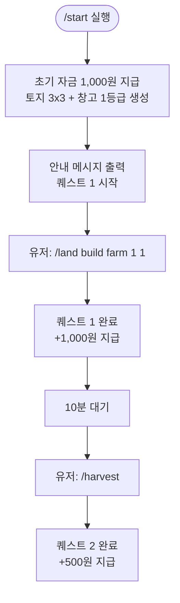

# 00. 온보딩 & 초반 스타팅

## 개요

신규 유저가 `/start` (또는 `/register`) 명령을 처음 실행할 때 일어나는 일을 정의한다.

## 초기 상태 지급 (가입 즉시)

| 항목      | 지급 내용                       | 비고                              |
| --------- | ------------------------------- | --------------------------------- |
| 초기 자금 | **1,000원**                     | 첫 T1 공장 1개 건설 가능          |
| 토지      | **3×3 (9슬롯)** 자동 생성       | 특수 슬롯 랜덤 배치 (15% 확률)    |
| 창고      | **1등급 (3,000슬롯)** 자동 배치 | 토지 (0,0) 슬롯 선점              |
| 튜토리얼  | 퀘스트 체인 자동 시작           | `/quest` 로 현재 퀘스트 확인 가능 |

> **왜 1,000원인가**: 퀘스트 1번("첫 공장 건설") 자체가 1,000원짜리 T1 공장 건설이다. 초기 자금 없이는 퀘스트를 시작조차 못하는 모순이 생기므로 최소한의 씨드머니를 지급한다.

## 튜토리얼 퀘스트 체인

퀘스트는 순서대로 진행되며, 완료 즉시 보상 지급. 건너뛰기 불가.


### 퀘스트 상세

| #   | 목표                        | 완료 조건               | 보상     | 누적 자금 (근사)    |
| --- | --------------------------- | ----------------------- | -------- | ------------------- |
| 1   | 첫 T1 공장 건설             | `/land build` 성공      | +1,000원 | 1,000원 → 0+1,000원 |
| 2   | 첫 수확                     | `/harvest` 성공         | +500원   | ~1,500원            |
| 3   | 자재 마켓 판매              | 자재 1개 이상 판매      | +500원   | ~2,000원            |
| 4   | 공장 1등급→2등급 업그레이드 | `/factory upgrade` 성공 | +2,000원 | ~4,000원            |
| 5   | 두 번째 T1 공장 건설        | T1 공장 2개 이상 보유   | +1,000원 | ~5,000원            |

> 퀘스트 완료 후 총 보상: **5,000원** (초기 씨드머니 1,000원 포함 총 6,000원 확보).  
> T1 공장을 최대 6개 건설하거나, 업그레이드 자금으로 사용하기에 충분한 수준.

### 퀘스트 1 상세 흐름 (닭-달걀 방지)



## 온보딩 완료 후 상태

튜토리얼 5단계 완료 기준 유저 상태 (예시):

```
보유 자금:   ~5,000원 (판매 수익 포함 가변)
공장:        T1 2개 (농장 2등급 + α)
창고:        1등급 (3,000슬롯)
레벨:        약 Lv.1~2
토지:        3×3 (공장 2개 + 창고 1개, 여유 슬롯 6개)
```

## 자재 기준가 (Base Price) — 경제 시스템 기반값

> **⚠️ 이 기준가가 없으면 경제 시스템 전체 검증 불가.** 직구매 가격, 업그레이드 비용 적정성, 마켓 상하한 모두 이 값에서 파생된다.

### T1 자재 기준가

| 자재 | 기준가      | 근거                                        |
| ---- | ----------- | ------------------------------------------- |
| 곡물 | **10원/개** | 저가·대량. 농장 30/tick × 10 = 300원/tick   |
| 광석 | **20원/개** | 중가·중속. 광산 15/tick × 20 = 300원/tick   |
| 목재 | **15원/개** | 저가·빠름. 목재소 25/tick × 15 = 375원/tick |
| 원유 | **50원/개** | 고가·느림. 유전 8/tick × 50 = 400원/tick    |

> T1 공장은 등급별 tick당 수익이 **300~400원/tick**으로 수렴하도록 기준가를 설정.  
> 공장 신축 비용 1,000원 ÷ tick당 수익 300원 = **약 3.3 tick(33분) 손익분기점**.

### T2 자재 기준가

| 자재     | 기준가      | 레시피 수익성 검증                                                           |
| -------- | ----------- | ---------------------------------------------------------------------------- |
| 철강     | **50원/개** | 소비: 광석 3×20=60원, 생산: 철강 5×50=250원 → **+190원/tick**                |
| 연료     | **80원/개** | 소비: 원유 2×50=100원, 생산: 연료 2×80+플라스틱 1×60=220원 → **+120원/tick** |
| 플라스틱 | **60원/개** | 정유소 부산물 (연료와 함께 생산)                                             |
| 가공식품 | **25원/개** | 소비: 곡물 5×10=50원, 생산: 가공식품 8×25=200원 → **+150원/tick**            |
| 가구     | **60원/개** | 소비: 목재 4×15=60원, 생산: 가구 6×60=360원 → **+300원/tick**                |

### T3 자재 기준가

| 자재        | 기준가       | 레시피 수익성 검증                                                       |
| ----------- | ------------ | ------------------------------------------------------------------------ |
| 자동차      | **500원/개** | 소비: 철강 3×50+플라스틱 2×60=270원, 생산: 500원 → **+230원/tick**       |
| 전자기기    | **800원/개** | 소비: 철강 1×50+플라스틱 3×60=230원, 생산: 800원 → **+570원/tick**       |
| 완제품 식품 | **150원/개** | 소비: 가공식품 4×25+연료 1×80=180원, 생산: 150×2=300원 → **+120원/tick** |

> T2/T3 공장은 원자재 조달 비용을 감안해도 T1 대비 **2~3배 높은 tick당 수익**. 레벨 제한(Lv.10/25)의 진입 장벽이 정당화된다.

## 미결정 사항

- [ ] 퀘스트 안내 메시지 텍스트 (Components v2 UI 설계)
- [ ] `/start` vs `/register` 명령어 이름 통일
- [ ] 재가입(탈퇴 후 재시작) 허용 여부 및 자산 초기화 정책
- [ ] 튜토리얼 스킵 옵션 (기존 게임 유경험자 대상)

## 관련 스키마

참조: [`packages/database/prisma/schema.prisma`](https://github.com/filename24/Idle-Factory/blob/stable/packages/database/prisma/schema.prisma)

- `User.money` — 초기값 1,000 (BigInt)
- `User.tutorialStep` — 현재 완료된 퀘스트 단계 (0~5, 5=완료)
- `Land` — 가입 시 자동 생성 (width:3, height:3)
- `Warehouse` — 가입 시 자동 생성 (grade:1, slotX:0, slotY:0)
- `GlobalMarketPrice` — `basePrice` 필드가 위 기준가 테이블과 일치해야 함
