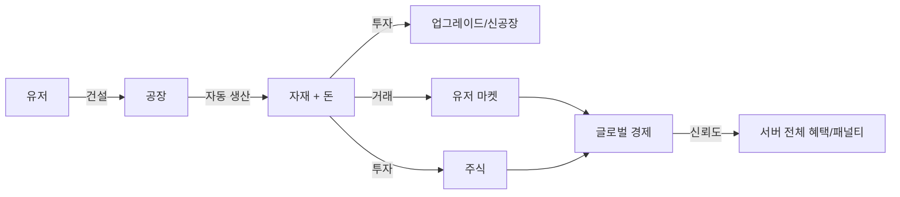

# 01. 프로젝트 개요

## 소개

모바일 게임 Idle Tycoon 모티브로 제작된 Discord 봇. 유저가 공장을 건설해 자재와 돈을 자동 생산하고, 유저 간 거래·주식·글로벌 경제 시스템에 참여하는 멀티서버 경제 시뮬레이션 게임.

## 주요 특징

- 빗금 명령어(`/`) 전용
- 현실 경제 시스템 (수요·공급에 따른 자재 가격 변동)
- 멀티 서버 글로벌 경제 (서버 단위 신뢰도/세금)
- i18n 지원 (추후)

## 핵심 컨셉

