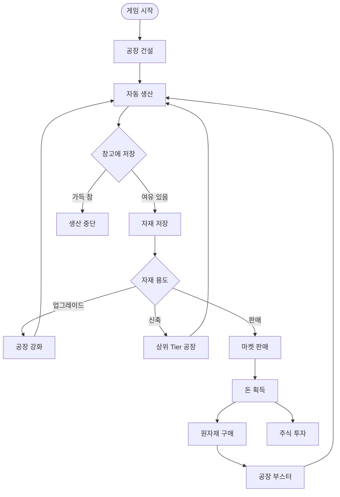
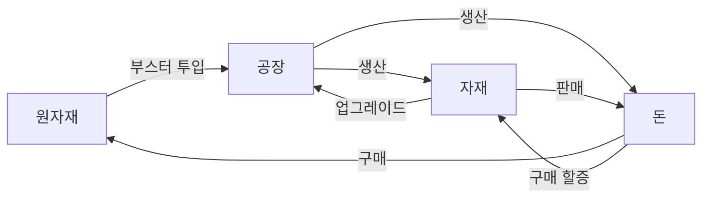

# 02. 코어 루프

## 게임플레이 루프

## 경험치 획득 행동

| 행동      | 경험치 |
| --------- | ------ |
| 공장 건설 | ⭕     |
| 유저 거래 | ⭕     |
| 주식 수익 | ⭕     |

> 구체적 수치는 `09-level-xp.md` 참조 (미정)

## 자원 흐름 요약

## 관련 스키마

참조: [`packages/database/prisma/schema.prisma`](https://github.com/filename24/Idle-Factory/blob/stable/packages/database/prisma/schema.prisma)

- `User.money`, `User.xp`, `User.level` — 유저 자산/성장
- `Factory`, `Factory.lastHarvestAt` — 자동 생산 tick 계산 기준
- `Warehouse`, `WarehouseStack` — 생산 결과 저장
- `MarketListing`, `GlobalMarketPrice` — 판매·구매 경로
