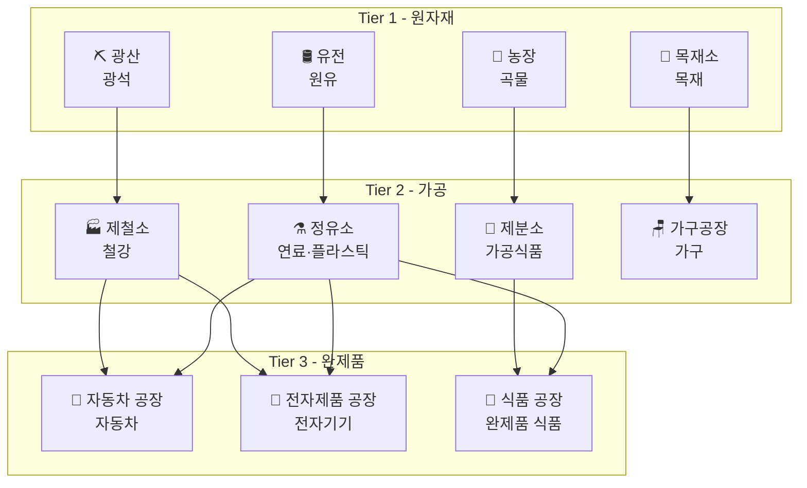
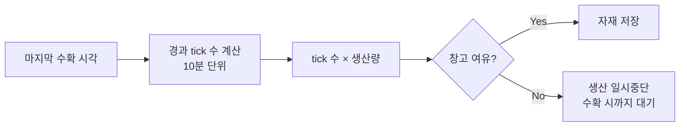
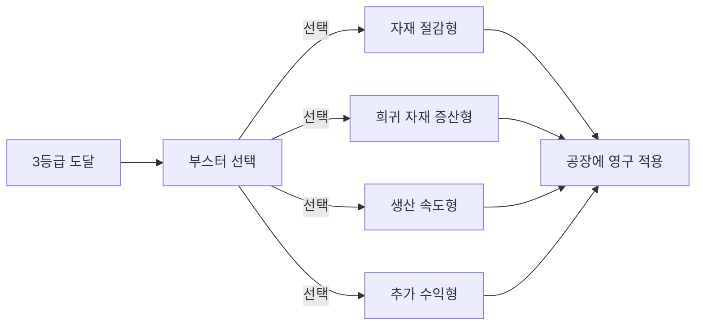
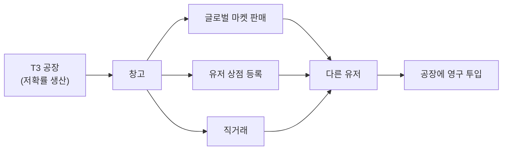
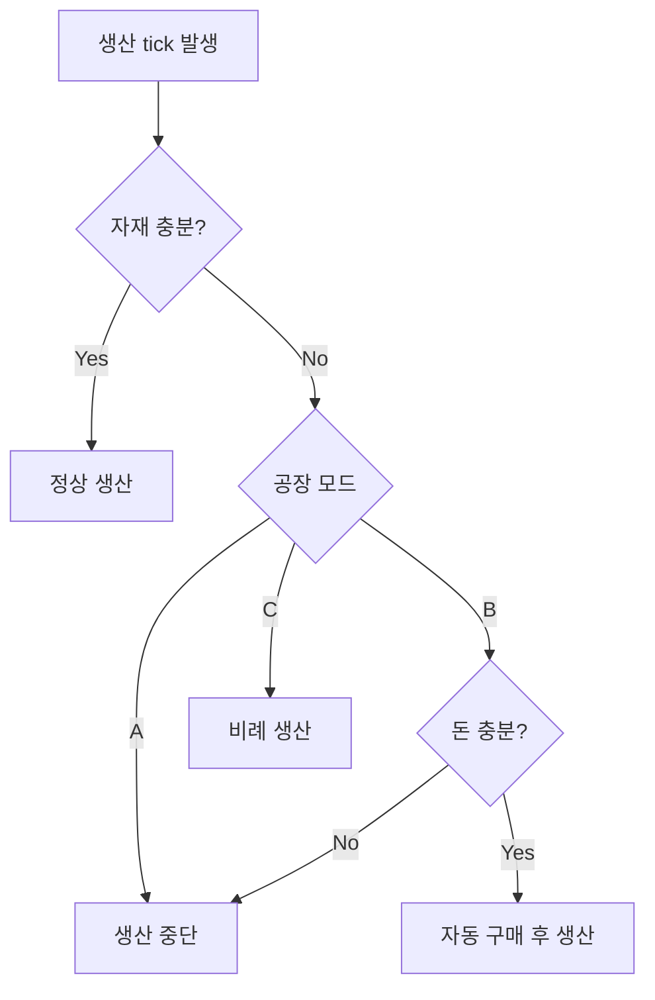

# 03. 공장 종류 및 생산 체인

## 구조

- **3-Tier 생산 체인** (T1 원자재 → T2 가공 → T3 완제품)
- 각 공장 타입은 내부적으로 **1~10 등급**으로 세분화

## 생산 체인 다이어그램



## Tier 1 - 원자재 생산

| 공장      | 생산 자재 | tick당 생산량 (1등급) | 특징      |
| --------- | --------- | --------------------- | --------- |
| 🌾 농장   | 곡물      | **30**                | 저가·대량 |
| ⛏️ 광산   | 광석      | **15**                | 중가·중속 |
| 🌲 목재소 | 목재      | **25**                | 저가·빠름 |
| 🛢️ 유전   | 원유      | **8**                 | 고가·느림 |

## Tier 2 - 가공 (레시피)

| 공장        | tick당 소비 | tick당 생산         |
| ----------- | ----------- | ------------------- |
| 🏭 제철소   | 광석 3      | 철강 5              |
| ⚗️ 정유소   | 원유 2      | 연료 2 + 플라스틱 1 |
| 🍞 제분소   | 곡물 5      | 가공식품 8          |
| 🪑 가구공장 | 목재 4      | 가구 6              |

## Tier 3 - 완제품 (레시피)

| 공장             | tick당 소비         | tick당 생산   |
| ---------------- | ------------------- | ------------- |
| 🚗 자동차 공장   | 철강 3 + 플라스틱 2 | 자동차 1      |
| 📱 전자제품 공장 | 철강 1 + 플라스틱 3 | 전자기기 1    |
| 🍱 식품 공장     | 가공식품 4 + 연료 1 | 완제품 식품 2 |

## 생산 주기 (Production Tick)

- **10분마다 1 tick** 생산
- **수동 수확**: 유저가 `/harvest` 명령으로 회수
- 계산 방식: `생산량 = floor((현재시각 − 마지막수확시각) / 10분) × 등급별 tick당 생산량`
- 미수확 자재가 창고 용량을 초과하면 **생산 중단** (초과분 손실 없음, 다음 수확 전까지 멈춤)



## 등급 시스템

각 공장은 1~10 등급으로 구분.

- **등급 상승 효과**: tick당 생산량 **× 1.5배** (복리)
- **업그레이드 비용**: 동일 Tier 하위 자재 + 돈
- **최대 등급**: 글로벌 신뢰도에 따라 달라짐 (07 참조)

### 등급별 생산량 예시 (농장 기준, 기본 30)

| 등급 | 배수   | tick당 | 시간당 (6 tick) |
| ---- | ------ | ------ | --------------- |
| 1    | 1.0×   | 30     | 180             |
| 2    | 1.5×   | 45     | 270             |
| 3    | 2.25×  | 68     | 405             |
| 4    | 3.38×  | 101    | 608             |
| 5    | 5.06×  | 152    | 911             |
| 6    | 7.59×  | 228    | 1,367           |
| 7    | 11.39× | 342    | 2,050           |
| 8    | 17.09× | 513    | 3,076           |
| 9    | 25.63× | 769    | 4,613           |
| 10   | 38.44× | 1,153  | 6,920           |

> 1.5배는 업계 표준값 (Cookie Clicker, AdVenture Capitalist 등). MVP 후 튜닝.

## 건설 · 업그레이드 비용

### 1등급 신축 비용

| Tier | 비용          | 추가 요구 자재 |
| ---- | ------------- | -------------- |
| T1   | **1,000원**   | 없음           |
| T2   | **10,000원**  | T1 자재 100개  |
| T3   | **100,000원** | T2 자재 50개   |

### 업그레이드 비용 공식

```
N → N+1 등급 비용 = 신축_비용 × 3^N
```

### 업그레이드 비용 예시 (농장 기준, 신축 1,000원)

| 등급 | 업그레이드 비용 | 누적 비용    |
| ---- | --------------- | ------------ |
| 1→2  | 3,000원         | 4,000원      |
| 2→3  | 9,000원         | 13,000원     |
| 3→4  | 27,000원        | 40,000원     |
| 4→5  | 81,000원        | 121,000원    |
| 5→6  | 243,000원       | 364,000원    |
| 6→7  | 729,000원       | 1,093,000원  |
| 7→8  | 2,187,000원     | 3,280,000원  |
| 8→9  | 6,561,000원     | 9,841,000원  |
| 9→10 | 19,683,000원    | 29,524,000원 |

### 추가 자재 요구

업그레이드 시 돈 + 같은 Tier의 하위 자재 소비:

- T1 공장 업그레이드: 자기 자신이 생산하는 자재 (예: 농장 → 곡물)
- T2 공장 업그레이드: T1 자재 (예: 제철소 → 광석)
- T3 공장 업그레이드: T2 자재 (예: 자동차 → 철강)

자재 요구량 공식:

```
N → N+1 필요 자재 = 기준량 × 2^N
```

예: 농장 1→2는 곡물 20개, 2→3은 40개, ... 9→10은 10,240개.

## 업그레이드 부스터 선택 시스템

특정 등급 업그레이드(예: **3·5·7·10등급**) 시점에 유저가 **부스터 특화**를 선택합니다. 한 번 고르면 해당 구간 내내 적용.

### 선택지

| 부스터                  | 효과                      | 적합 대상  |
| ----------------------- | ------------------------- | ---------- |
| 🔻 **자재 절감형**      | 소비 자재 -20%            | T2/T3 공장 |
| 🔺 **희귀 자재 증산형** | 저확률 희귀 자재 드롭 +1% | T1/T2 공장 |
| ⚡ **생산 속도형**      | tick당 생산량 +15%        | 모든 공장  |
| 💰 **추가 수익형**      | 공장 수익 +10%            | 모든 공장  |

### 선택 규칙

- **중복 선택 불가**: 한 공장당 하나의 부스터 경로만
- **변경 가능**: 돈 대량 소비 시 리셋 가능 (비용 높음)
- **희귀 자재**: T2/T3 레시피에 선택적 소비재로 활용 (후속 설계)



## 🧪 원자재 부스터 (Lv.50 해금)

"업그레이드 부스터"와 별개의 **소모성 원자재 아이템**. 공장에 투입하면 영구 효과를 부여합니다.

| 항목      | 규칙                                                     |
| --------- | -------------------------------------------------------- |
| 해금 조건 | 유저 **Lv.50** (09-level-xp.md)                          |
| 지속시간  | **영구** (공장당 1회 소비, 회수 불가)                    |
| 중복      | 공장당 **1개**만 적용 (교체 불가)                        |
| 효과      | **등급 보너스 ×1.2** (현재 배율 `1.5^N` → `1.5^N × 1.2`) |

### 효과 예시

- 일반 5등급 공장: `1.5^4 = 5.06배`
- 부스터 적용 5등급: `5.06 × 1.2 = 6.07배`
- 10등급: `38.44배 → 46.13배`

### 획득 경로 (3단 유통)



- **1차 생산**: 특정 T3 공장(예: 자동차·전자제품)이 **0.5~1% 확률**로 생산
- **유통 경로 3종 모두 허용**: 글로벌 마켓 / 유저 상점 / 직거래
- **경제적 의미**: 생산·거래의 최종 소비재 역할 → 영구 소모로 인플레 방지

## 자재 부족 시 동작 (T2/T3)

유저가 공장별로 동작 모드를 **직접 설정**. 기본값은 **A**.

| 모드         | 동작                                              |
| ------------ | ------------------------------------------------- |
| **A (기본)** | 생산 중단, 자재 채워질 때까지 대기                |
| **B**        | 부족분 마켓 자동 구매 (글로벌 가격 기준, 돈 소모) |
| **C**        | 부족분 비례로 일부만 생산                         |

유저는 `/factory setmode <공장> <A|B|C>` 같은 명령으로 변경 가능.



## MVP 범위

초기 릴리스에는 아래 6개만 먼저 구현:

| Tier | 공장               |
| ---- | ------------------ |
| T1   | 농장, 광산, 목재소 |
| T2   | 제철소, 제분소     |
| T3   | 자동차 공장        |
