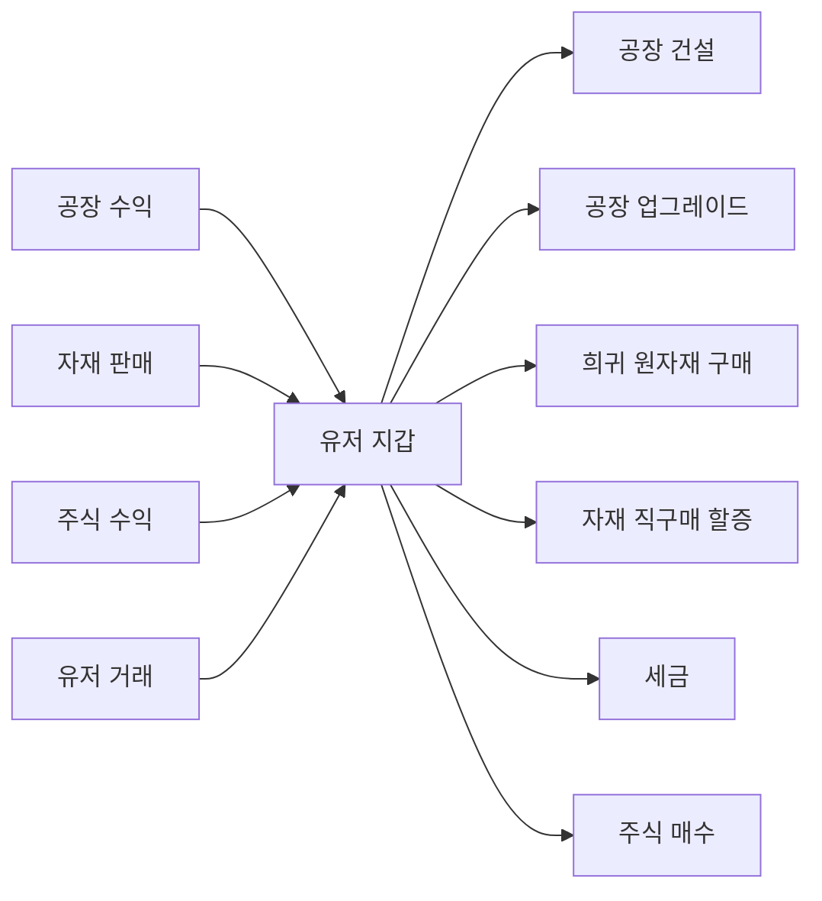
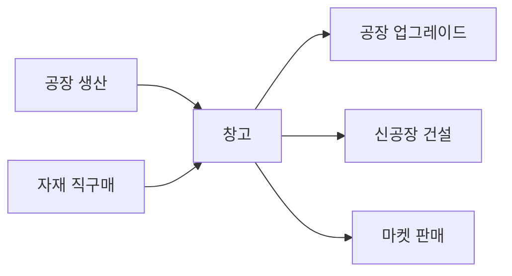

# 04. 경제 시스템

## 화폐와 자원의 종류

| 항목                         | 설명                   | 획득 경로                                                 |
| ---------------------------- | ---------------------- | --------------------------------------------------------- |
| 💰 돈                        | 기본 통화              | 공장 수익, 자재 판매, 주식, 유저 거래                     |
| 📦 자재                      | 공장이 생산하는 결과물 | 공장 자동 생산                                            |
| 🧪 희귀 원자재 (RAW_BOOSTER) | 공장 부스터 용         | 공장 생산 RARE 드롭 (글로벌 마켓·유저 상점 유통은 미구현) |

## 자재 직구매 (돈 → 자재)

### 규칙 (확정)

| 항목           | 규칙                                     |
| -------------- | ---------------------------------------- |
| 가격           | 글로벌 마켓 기준가 **×2배 할증**         |
| 구매 가능 자재 | **T1 + T2 자재만** (T3 완제품은 불가)    |
| 일일 한도      | 레벨별 타이트 한도 (아래 테이블)         |
| 목적           | 급할 때 보조 수단. 정상 루프는 공장 생산 |

### 레벨별 일일 한도

| 레벨 구간 | 하루 최대 구매량 |
| --------- | ---------------- |
| 1 ~ 5     | 100 개           |
| 6 ~ 15    | 500 개           |
| 16 ~ 30   | 2,000 개         |
| 31+       | 10,000 개        |

- **총합 한도**: 자재 종류와 무관하게 합산 (예: 곡물 50 + 광석 50 = 100, 한도 소진)
- **리셋 시각**: 매일 KST(UTC+9) 자정 (#16 확정)

> **코드 기준**: `packages/game-core/src/economy/kst.ts` 의 `kstDayStart`/`kstNextDayStart` 가 KST 자정 경계를 계산하고, `DailyPurchase.date` 가 그 경계의 UTC 순간을 일자 키로 저장한다 (U-6 주간 정산 KST 기준과 일관되게 #16 에서 확정).

### 가격 결정

```
구매가 = 글로벌 마켓 현재가 × 2
```

글로벌 마켓 가격이 변동하면 직구매 가격도 변동. 마켓 폭등 시 직구매도 비싸짐.

## 돈 흐름



## 자재 흐름



## 희귀 원자재 흐름

> **미구현 (후속 스코프)**: 03-factories.md §획득 경로가 계획한 글로벌 마켓·유저 상점·직거래 3단 유통은 현재 코드에 없다. 직구매(`packages/game-core/src/economy/directBuy.ts` `DIRECT_BUY_MATERIALS`)와 마켓(`apps/bot/src/commands/game/market.ts` `MATERIAL_CHOICES`, `apps/bot/src/services/marketSell.ts`) 양쪽 모두 RAW_BOOSTER 를 취급 대상에서 제외하며, 실제 획득 경로는 공장 생산 중 RARE 드롭과 개발용 `/debug give-raw-booster` 뿐이다.


## 경제 순환을 유지하는 장치

1. **인플레이션 방지**: 세금, 유지비, 희귀 원자재 구매가 돈을 회수
   > **미구현**: 현재 실제로 동작하는 회수 장치는 세금뿐이다 — 주간 자산 누진세(`WEEKLY_TAX_BRACKETS`)와 유저 상점 기간별 판매세(`LISTING_TAX_BRACKETS`, `packages/game-core/src/economy/tax.ts`). 공장 유지비(upkeep)는 코드베이스 어디에도 구현되어 있지 않고, 희귀 원자재(RAW_BOOSTER) 구매는 위 §희귀 원자재 흐름에서 밝힌 대로 매매 경로 자체가 없어(직구매도 대상 제외) 회수 수단으로 기능하지 않는다. 위 §돈 흐름 다이어그램의 "희귀 원자재 구매" 노드도 같은 이유로 현재는 발생하지 않는다.
2. **자재 생산 루프 유지**: 직구매 할증 + 일일 한도
3. **거래 활성화**: T2/T3 공장이 타 공장 자재를 요구
4. **비활성 서버 경제**: 30일 비활성 시 금고 분배 (07 참조)

## 관련 스키마

참조: [`packages/database/prisma/schema.prisma`](https://github.com/filename24/Idle-Factory/blob/stable/packages/database/prisma/schema.prisma)

- `User.money` — 유저 지갑 (BigInt)
- `User.dailyBought`, `User.dailyBoughtResetAt` — deprecated (#16), 미사용. 일일 한도의 단일 진실 소스는 아래 `DailyPurchase`
- `DailyPurchase` — 일자별 직구매 합산 (`userId + date` unique)
- `GlobalMarketPrice` — 자재별 기준가·현재가 (직구매가 = `currentPrice × 2`)
- `WeeklySettlement` — 주 1회 세금 정산 기록
- `enum TradeKind` — `DIRECT_BUY` 등 거래 분류
