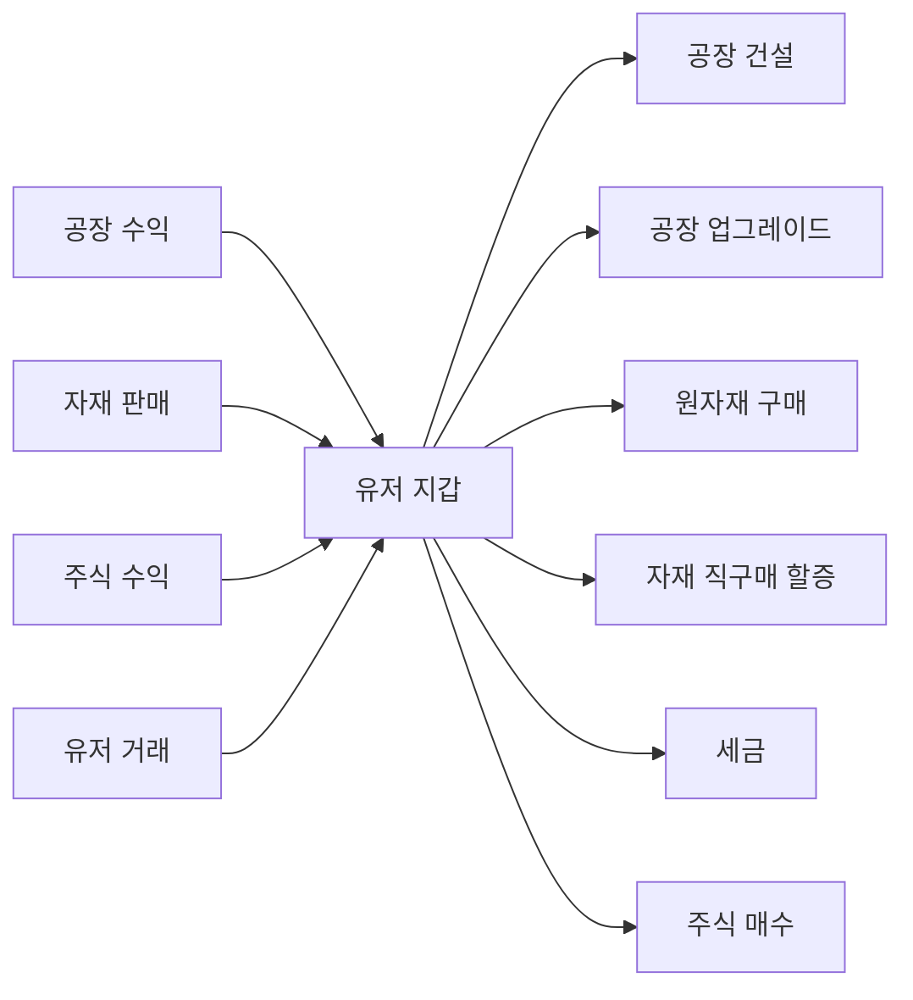
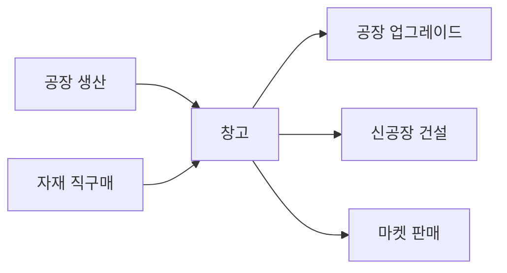
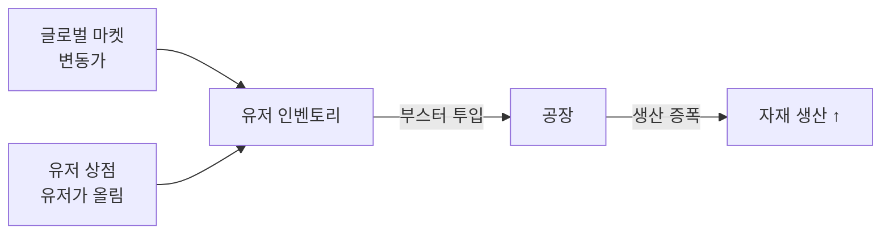

# 04. 경제 시스템

## 화폐와 자원의 종류

| 항목      | 설명                   | 획득 경로                             |
| --------- | ---------------------- | ------------------------------------- |
| 💰 돈     | 기본 통화              | 공장 수익, 자재 판매, 주식, 유저 거래 |
| 📦 자재   | 공장이 생산하는 결과물 | 공장 자동 생산                        |
| 🧪 원자재 | 공장 부스터 용         | 글로벌 마켓, 유저 상점                |

## 자재 직구매 (돈 → 자재)

### 규칙 (확정)

| 항목           | 규칙                                     |
| -------------- | ---------------------------------------- |
| 가격           | 글로벌 마켓 기준가 **×2배 할증**         |
| 구매 가능 자재 | **T1 + T2 자재만** (T3 완제품은 불가)    |
| 일일 한도      | 레벨별 타이트 한도 (아래 테이블)         |
| 목적           | 급할 때 보조 수단. 정상 루프는 공장 생산 |

### 레벨별 일일 한도

| 레벨 구간 | 하루 최대 구매량 |
| --------- | ---------------- |
| 1 ~ 5     | 100 개           |
| 6 ~ 15    | 500 개           |
| 16 ~ 30   | 2,000 개         |
| 31+       | 10,000 개        |

- **총합 한도**: 자재 종류와 무관하게 합산 (예: 곡물 50 + 광석 50 = 100, 한도 소진)
- **리셋 시각**: 매일 UTC 00:00 (or 서버 시각 기준)

### 가격 결정

```
구매가 = 글로벌 마켓 현재가 × 2
```

글로벌 마켓 가격이 변동하면 직구매 가격도 변동. 마켓 폭등 시 직구매도 비싸짐.

## 돈 흐름



## 자재 흐름



## 원자재 흐름



## 경제 순환을 유지하는 장치

1. **인플레이션 방지**: 세금, 유지비, 원자재 구매가 돈을 회수
2. **자재 생산 루프 유지**: 직구매 할증 + 일일 한도
3. **거래 활성화**: T2/T3 공장이 타 공장 자재를 요구
4. **비활성 서버 경제**: 30일 비활성 시 금고 분배 (07 참조)
