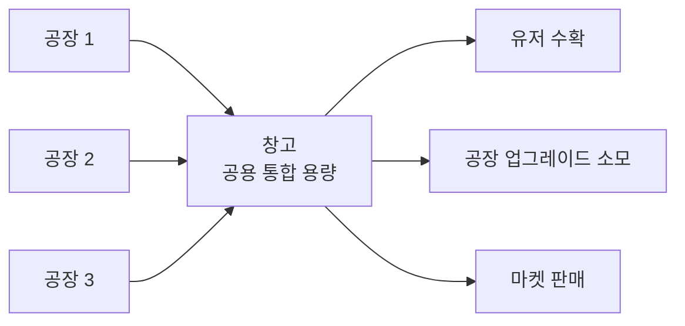
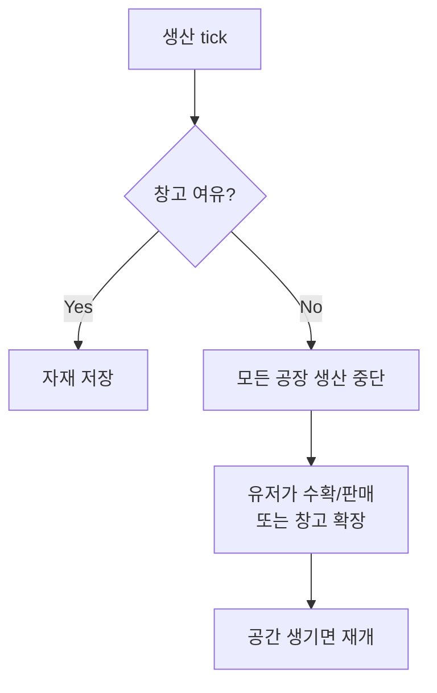

# 05. 창고 시스템

## 개요

공장은 자동 생산하지만, 생산된 자재는 **창고**에 저장된다. 창고가 가득 차면 생산이 멈춘다.

## 확정된 설계

- **공용 창고 1개** (A-1): 유저당 1개 창고, 모든 자재 통합 용량
- **토지 슬롯 차지** (D-2): 창고도 공장처럼 **토지 위 1 슬롯**을 차지함
- **가득 차면 생산 중단** (C-a): 자재가 수확되거나 창고가 확장될 때까지 공장 멈춤
- **자재별 부피 계수** (#21 결정 4): 1 개가 차지하는 슬롯 수가 자재마다 다르다. 아래 §부피 계수 참조 (도입 전에는 종류 무관 1 자재 = 1 슬롯이었다)

## 창고 구조



## 창고 동작 (가득 참)



## 토지 슬롯 차지 (D-2)

- 기본 3×3 토지에 **창고 1개 필수** → 공장 배치 가능 슬롯은 8개
- 창고를 철거할 수는 없음 (필수 건물)
- 창고도 이모지로 표시: 📦 (등급은 상첨자: 📦³)

### 예시 (3×3 기본 토지)

```
📦¹ 🌾¹ 🟩
⛏¹ 🟩 🟩
🟩 🟩 🟩
```

## 창고 등급 & 용량

| 등급     | 슬롯 수    | 업그레이드 비용          |
| -------- | ---------- | ------------------------ |
| 1 (기본) | 3,000      | —                        |
| 2        | 9,000      | 5,000원 + 목재 100       |
| 3        | 27,000     | 15,000원 + 목재 300      |
| 4        | 81,000     | 50,000원 + 목재 1,000    |
| 5        | 243,000    | 150,000원 + 철강 200     |
| 6        | 729,000    | 500,000원 + 철강 500     |
| 7        | 2,187,000  | 1,500,000원 + 철강 1,500 |
| 8        | 6,561,000  | 5,000,000원 + 자동차 10  |
| 9        | 19,683,000 | 15,000,000원 + 자동차 30 |
| 10       | 59,049,000 | 50,000,000원 + 자동차 50 |

공식:

- 용량: 등급당 **×3** (전 등급 일관 적용 — `3,000 × 3^(등급−1)`)
- 비용(코드 기준 `packages/game-core` `WAREHOUSE_UPGRADE_COST`): **위 테이블이 진실**. 금액은 5,000 → 15,000 → 50,000 → 150,000 … 로 **2등급마다 정확히 ×10**(×3 · ×3.33 교대) 상승하고, 요구 원료는 목재 → 철강 → 자동차로 단계 상승한다. **일률 ×3배가 아니다.**

> **설계 의도**: 1등급(3,000슬롯)은 초기 공장 1개 기준 약 16시간치. 공장이 늘어날수록 창고가 빨리 차서 업그레이드 압박이 자연스럽게 생김 — 초반 잦은 접속 유도, 성장 목표 제공.

## 부피 계수 (#21 결정 4)

**자재 1 개가 차지하는 슬롯 수.** `MATERIAL_VOLUME` (`packages/game-core/src/warehouse/capacity.ts`).

| 자재           | 계수 | 자재             |  계수 |
| -------------- | ---: | ---------------- | ----: |
| 곡물 (GRAIN)   |    1 | 광석 (ORE)       | **2** |
| 목재 (WOOD)    |    1 | 원유 (CRUDE_OIL) | **5** |
| T2 가공재 전체 |    1 | T3 완제품 전체   |     1 |

### 왜 필요했나

창고 용량은 **개수** 기준인데, T1 산출량은 tick당 300~400원이 되도록 **금액**으로
정규화되어 있다(00-onboarding.md §밸런스 기준). 그래서 단가가 비싼 저(低)산출
공장은 창고가 좀처럼 차지 않아 위 §설계 의도의 "접속 유도"가 작동하지 않았다.

| 공장   |   도입 전 | 도입 후 | 목표 16h ±25% |
| ------ | --------: | ------: | :------------ |
| 농장   |     16.7h |   16.7h | ✅            |
| 광산   | **33.3h** |   16.7h | ❌ → ✅       |
| 목재소 |     20.0h |   20.0h | ✅            |
| 유정   | **62.5h** |   12.5h | ❌ → ✅       |

### 왜 T1 에만 주는가

계수를 단가 비례로 전 자재에 주면 원(₩)당 창고 점유가 모든 자재에서 균일해져,
"가공할수록 창고를 덜 잡는다"는 T2/T3 의 존재 이유가 사라진다. 티어 수익 배수
목표를 폐기한 대신(00-onboarding.md §티어의 가치, #21 결정 3) 이 부피 효율을
T2/T3 의 가치로 확정했으므로, 계수는 T1 원자재에만 적용한다.

| 티어 | 창고 1칸당 가치 |     T1 대비 |
| ---- | --------------: | ----------: |
| T1   |         11.25원 |      1.00배 |
| T2   |         53.75원 |  **4.78배** |
| T3   |        483.33원 | **42.96배** |

계수는 **정수만** 쓴다 — 창고 계산이 전부 `bigint` 라 소수 계수는 정밀도 손실
없이 곱할 수 없다. 회귀는 `simulation/targets.ts` 의
`checkWarehouseBottleneck` · `checkWarehouseValueDensity` 가 감시한다.

### 기존 재고 처리

계수 도입으로 이미 쌓인 재고의 점유량이 늘어 초과 상태가 될 수 있다. `computeFree`
가 음수를 0 으로 클램프하므로 **자재는 소실되지 않고 수확만 멈춘다** — 유저는
판매하거나 창고를 올려 해소한다.

## 용량 계산 예시

농장 5등급 (152개/tick, 계수 1) + 광산 5등급 (76개/tick, 계수 2) 운영 시:

- 10분마다 228 **개** 생산 → 부피는 152×1 + 76×2 = **304 슬롯**
- 1시간 방치: 1,824 슬롯 필요 → 창고 2등급(9,000)이면 여유
- 하루 방치: 43,776 슬롯 → 창고 4등급(81,000) 필요

> 개수와 부피를 섞어 계산하지 않도록 주의한다. 용량·여유·클램프는 모두 **슬롯(부피)**
> 단위이고, 생산량·판매 수량은 **개수** 단위다. 변환은 `volumeOf` / `unitsThatFit`.

## 데이터 구조 (제안)

```ts
interface Warehouse {
  userId: string // Discord snowflake
  grade: number // 1~10
  capacity: number // 등급으로부터 계산
  contents: Record<MaterialType, number> // 자재별 저장량
  slotX: number // 토지 내 X
  slotY: number // 토지 내 Y
}
```

## 미결정 사항

- [ ] 창고가 가득 찼을 때 **알림** 방식 (DM? 서버 채널?)
- [ ] 창고 초과 생산을 무시하고 **자동 판매** 옵션 (MVP 이후)
- [ ] 등급 10 이후 **더 큰 창고** (서버 창고? 길드 창고?)

## 관련 스키마

참조: [`packages/database/prisma/schema.prisma`](https://github.com/filename24/Idle-Factory/blob/stable/packages/database/prisma/schema.prisma)

- `Warehouse` — 유저당 1개 (`userId` unique), `grade` 1~10 (용량은 등급에서 계산)
- `WarehouseStack` — 자재별 보유량 (`warehouseId + material` unique, `count: BigInt`)
- `enum MaterialType` — 저장 가능한 자재 타입 13종
- 토지 슬롯 차지는 `Land` / `Slot` 참고 (11-land.md)
