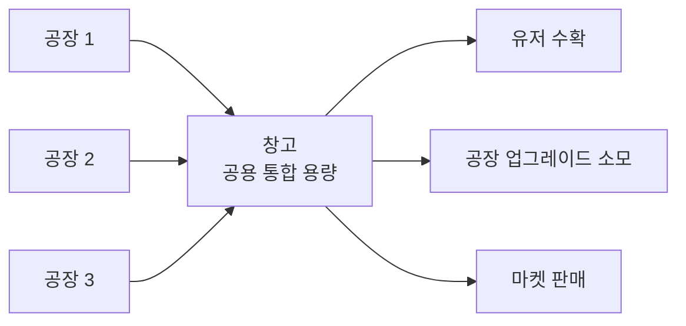
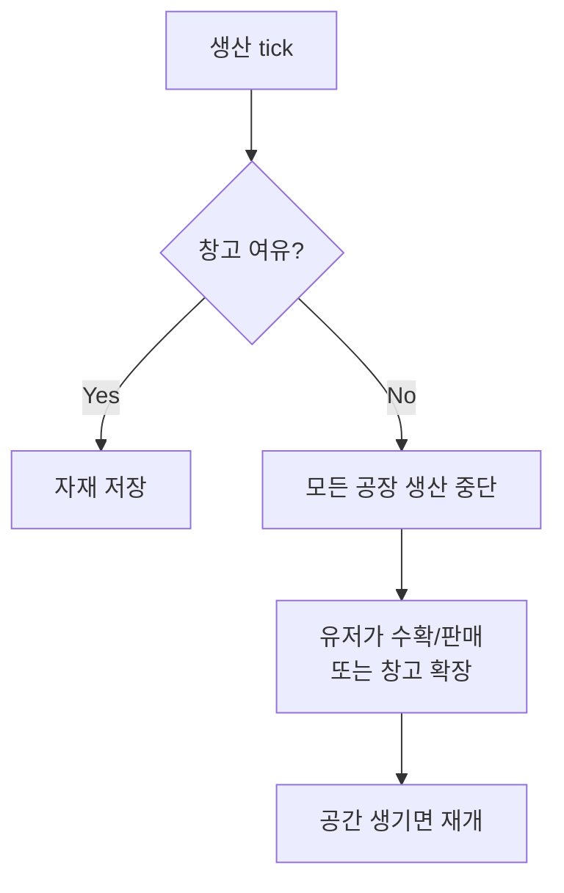

# 05. 창고 시스템

## 개요

공장은 자동 생산하지만, 생산된 자재는 **창고**에 저장된다. 창고가 가득 차면 생산이 멈춘다.

## 확정된 설계

- **공용 창고 1개** (A-1): 유저당 1개 창고, 모든 자재 통합 용량
- **토지 슬롯 차지** (D-2): 창고도 공장처럼 **토지 위 1 슬롯**을 차지함
- **가득 차면 생산 중단** (C-a): 자재가 수확되거나 창고가 확장될 때까지 공장 멈춤
- **1 자재 = 1 슬롯** (자재 종류 무관, 통합 용량 계산)

## 창고 구조



## 창고 동작 (가득 참)



## 토지 슬롯 차지 (D-2)

- 기본 3×3 토지에 **창고 1개 필수** → 공장 배치 가능 슬롯은 8개
- 창고를 철거할 수는 없음 (필수 건물)
- 창고도 이모지로 표시: 📦 (등급은 상첨자: 📦³)

### 예시 (3×3 기본 토지)

```
📦¹ 🌾¹ 🟩
⛏¹ 🟩 🟩
🟩 🟩 🟩
```

## 창고 등급 & 용량

| 등급     | 슬롯 수    | 업그레이드 비용          |
| -------- | ---------- | ------------------------ |
| 1 (기본) | 3,000      | —                        |
| 2        | 9,000      | 5,000원 + 목재 100       |
| 3        | 27,000     | 15,000원 + 목재 300      |
| 4        | 81,000     | 50,000원 + 목재 1,000    |
| 5        | 243,000    | 150,000원 + 철강 200     |
| 6        | 729,000    | 500,000원 + 철강 500     |
| 7        | 2,187,000  | 1,500,000원 + 철강 1,500 |
| 8        | 6,561,000  | 5,000,000원 + 자동차 10  |
| 9        | 19,683,000 | 15,000,000원 + 자동차 30 |
| 10       | 59,049,000 | 50,000,000원 + 자동차 50 |

공식:

- 용량: 등급당 **×3** (전 등급 일관 적용)
- 비용: 등급당 ×3배

> **설계 의도**: 1등급(3,000슬롯)은 초기 공장 1개 기준 약 16시간치. 공장이 늘어날수록 창고가 빨리 차서 업그레이드 압박이 자연스럽게 생김 — 초반 잦은 접속 유도, 성장 목표 제공.

## 용량 계산 예시

농장 5등급 (152/tick) + 광산 5등급 (76/tick) 운영 시:

- 10분마다 228 자재 생산
- 1시간 방치: 1,368 슬롯 필요 → 창고 2등급(9,000)이면 여유
- 하루 방치: 32,832 슬롯 → 창고 4등급(81,000) 필요

## 데이터 구조 (제안)

```ts
interface Warehouse {
  userId: string // Discord snowflake
  grade: number // 1~10
  capacity: number // 등급으로부터 계산
  contents: Record<MaterialType, number> // 자재별 저장량
  slotX: number // 토지 내 X
  slotY: number // 토지 내 Y
}
```

## 미결정 사항

- [ ] 창고가 가득 찼을 때 **알림** 방식 (DM? 서버 채널?)
- [ ] 창고 초과 생산을 무시하고 **자동 판매** 옵션 (MVP 이후)
- [ ] 등급 10 이후 **더 큰 창고** (서버 창고? 길드 창고?)

## 관련 스키마

참조: [`packages/database/prisma/schema.prisma`](https://github.com/filename24/Idle-Factory/blob/stable/packages/database/prisma/schema.prisma)

- `Warehouse` — 유저당 1개 (`userId` unique), `grade` 1~10 (용량은 등급에서 계산)
- `WarehouseStack` — 자재별 보유량 (`warehouseId + material` unique, `count: BigInt`)
- `enum MaterialType` — 저장 가능한 자재 타입 13종
- 토지 슬롯 차지는 `Land` / `Slot` 참고 (11-land.md)
