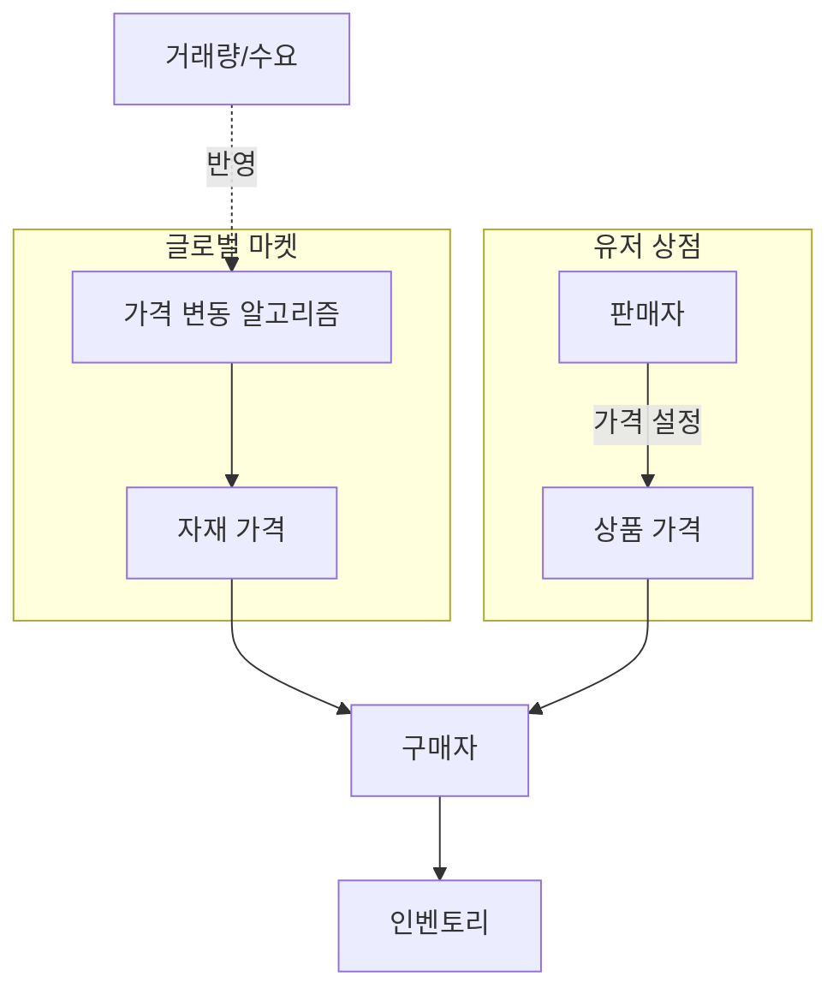
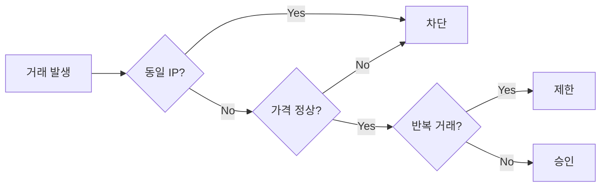

# 06. 마켓 시스템

## 두 가지 마켓

| 마켓           | 판매자 | 가격 결정               |
| -------------- | ------ | ----------------------- |
| 🌐 글로벌 마켓 | 시스템 | 변동가 (수요·공급 기반) |
| 🏪 유저 상점   | 유저   | 유저가 직접 올림        |

## 마켓 구조



## 글로벌 마켓 — 가격 변동

| 항목         | 값                                  |
| ------------ | ----------------------------------- |
| 변동 주기    | **30분**                            |
| 기본 변동 폭 | **±20%** (랜덤 노이즈)              |
| 변동 원인    | **하이브리드** (랜덤 + 거래량 기반) |
| 가격 상하한  | 기준가의 **70% ~ 200%**             |

### 가격 산출 공식

```
newPrice = clamp(
  basePrice × (1 + noise) × (1 + demandFactor),
  basePrice × 0.70,
  basePrice × 2.00
)

noise         = Random(-0.20, +0.20)
demandFactor  = (recentSales - avgSales) / avgSales × k   // k: 보정 계수 (예: 0.1)
```

- **30분마다** 모든 자재 가격 재계산
- **거래량 보정**: 최근 30분 판매량이 평균보다 많으면 상승, 적으면 하락
- **극단값 방지**: 하한 70%, 상한 200%로 clamp
- **유저 직구매 가격** = `newPrice × 2` (04-economy.md 참고)
- **0-나눗셈 가드 (U-5, 2026-07-03 확정)**: `avgSales = 0` 이면 `demandFactor = 0` 으로 처리(랜덤 노이즈만 적용).

> **코드 기준**: 공식은 `packages/game-core/src/market/price.ts` 의 `computeNextPrice` 가, U-5 가드는 같은 파일의 `computeDemandFactorPpm` 이 (`avgSales <= 0` → `0n`) 구현한다. `avgSales` 는 `computeNextAvgSales` 의 EMA 로 갱신되며, 30분 주기 실행은 `apps/bot/src/scheduled-tasks/market-price-tick.ts` 의 `MarketPriceTickTask` 가 담당한다.

### 유저 → 글로벌 판매 (U-3, 2026-07-03 확정)

유저가 자재를 **글로벌 마켓에 즉시 매도**하는 경로 (유저 상점 등록과 별개):

| 항목      | 규칙                                                         |
| --------- | ------------------------------------------------------------ |
| 판매가    | 글로벌 **현재가 × 100%** (직구매의 `× 2` 할증과 대칭)        |
| 수수료    | **0** (서버 금고 수수료 없음)                                |
| 수요 반영 | 판매 수량을 `recentSales` 에 반영 → 다음 변동 주기 하락 압력 |
| 수량 한도 | **무제한** (v1)                                              |

> **코드 기준**: `apps/bot/src/services/marketSell.ts` 의 `MarketSellService` 가 위 스펙대로 구현하며 `/마켓 판매`(`market sell`) 서브커맨드로 노출된다. 체결 시 `recentSales += qty` 로 다음 tick 의 demandFactor 에 반영하고, `TradeLog` 에 `kind=MARKET_SELL`·`toUserId=null` 로 기록한다.

## 유저 상점 — 규칙

| 항목             | 규칙                                      |
| ---------------- | ----------------------------------------- |
| 기본 수수료      | 판매가의 **3%** (서버 금고로 귀속)        |
| 동시 등록 한도   | `5 + floor(level/5)` (최대 **20개**)      |
| 등록 기간        | **최대 30일** (유저 선택), 이후 자동 회수 |
| 기간별 추가 세율 | 기간이 길수록 세율 증가 (아래 표)         |
| 가격 제한        | 글로벌 가격의 **±50% 범위**만 허용        |

> **미구현 (후속 스코프)**: 동시 등록 한도(`5 + floor(level/5)`, 최대 20개) 규칙은 확정 스펙이나
> `MarketService.list()`(`apps/bot/src/services/market.ts`)에는 반영되어 있지 않다 — 유저의 활성
> 매물(status=ACTIVE) 개수를 세거나 제한하는 코드가 없어 현재는 등록 개수가 무제한이다.

### 기간별 세율 테이블

등록 기간을 길게 설정할수록 시장 선점 효과가 커지므로, 세율을 누진 적용합니다.

| 등록 기간 | 총 세율 (기본 3% + 기간 할증) |
| --------- | ----------------------------- |
| 1~3일     | 3%                            |
| 4~7일     | 5%                            |
| 8~14일    | 8%                            |
| 15~21일   | 12%                           |
| 22~30일   | 18%                           |

공식:

```
tax = salePrice × rateByDuration(days)   // salePrice = 총 판매액(수량 × 단가)
netRevenue = salePrice - tax
```

> **코드 기준**: `apps/bot/src/services/market.ts` 의 `calcTax(gross, taxRate)` 는 `gross = qty × price`(총 판매액)에 세율을 곱한다. 기존 `basePrice ×` 곱셈은 차원 오류였다.

> **인플레 억제 의도**: 장기 등록은 공급 잠금 효과가 있어 시장 가격을 왜곡. 누진 세금으로 장기 매물 회전율을 유도.

### 만료·취소 회수 (U-1, 2026-07-03 확정)

등록 매물이 **만료**되거나 판매자가 **취소**하면 잠갔던 자재를 판매자 창고로 되돌린다.

- **용량 무시 강제 입고**: 회수 시 창고 용량을 검사하지 않고 무조건 재입고한다 (우편함 등 별도 보관소 없음).
- 이로 인해 창고가 용량을 초과하면 **생산 중단 상태가 유지**된다 (03·05의 초과 시 생산 정지 규칙). 유저가 수확·판매로 공간을 확보하면 재개된다.

> **코드 기준**: `market.ts` 의 `returnStackAndMark` 는 `warehouseStack.upsert({ increment })` 로 용량 가드 없이 재입고하며, `cancel`·`expireStale` 가 공유한다.

## 사기 방지 규칙

자기 자신과의 거래로 경험치·돈을 파밍하지 못하게:

1. 같은 IP / 같은 디스코드 계정의 부계정 간 거래 제한
2. 짧은 시간 내 반복 거래 감지 (스팸 방지)
3. 비정상적으로 낮거나 높은 가격 거래 차단
4. 신규 계정은 일정 기간 마켓 제한

> **미구현 (후속 스코프)**: 위 1·4번 규칙은 확정 스펙이나 현재 코드에는 반영되어 있지 않다. IP 취득이
> 기술적으로 불가능해(1번) 신규 계정·신규 서버 멤버 여부를 대체 신뢰 시그널로 계산하지만
> (`assessActorTrust()`, `apps/bot/src/services/tradeLog.ts`), `logMarketBuySignal()`
> (`apps/bot/src/commands/game/market.ts`)이 구조화 로깅만 남길 뿐(v0, 비차단) 실제로 거래를 막거나
> 제한하는 코드는 없다.



## 동시성·정합성 (U-4, 2026-07-03 확정)

동시 구매·만료 레이스와 자기거래를 코드 레벨에서 차단한다.

- **트랜잭션 격리**: 모든 상태 변경(등록·구매·취소·만료)은 `runInTx` 로 **Serializable** 격리에서 실행한다.
- **쓰기 충돌 재시도**: 직렬화 충돌·데드락(**P2034**)은 full-jitter 백오프로 최대 5회 재시도한다 (`apps/bot/src/services/base.ts`).
- **자기 리스팅 구매 금지**: 구매자와 판매자가 같으면 `SELF_PURCHASE` 로 거부한다.
- **상태·만료 재검증**: 구매 트랜잭션 내부에서 `status === ACTIVE` 및 `expiresAt > now` 를 다시 확인해, 이미 팔렸거나 만료된 매물의 이중 판매를 막는다.

## 관련 스키마

참조: [`packages/database/prisma/schema.prisma`](https://github.com/filename24/Idle-Factory/blob/stable/packages/database/prisma/schema.prisma)

- `GlobalMarketPrice` — 자재별 변동가 (`basePrice`, `currentPrice`, `recentSales`, `updatedAt`) · 30분 주기 갱신
- `MarketListing` — 유저 상점 등록 (`price`, `qty`, `durationDays`, `taxRate`, `status`, `expiresAt`)
- `enum ListingStatus` — ACTIVE / SOLD / EXPIRED / CANCELED
- `TradeLog` — 거래 이력 (사기 방지·XP 중복 방지), `enum TradeKind` = MARKET_SELL / USER_TRADE / DIRECT_BUY 등
