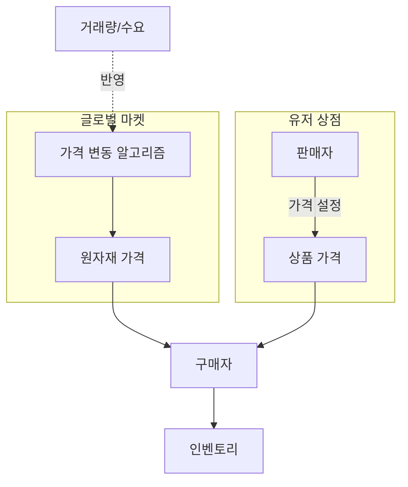
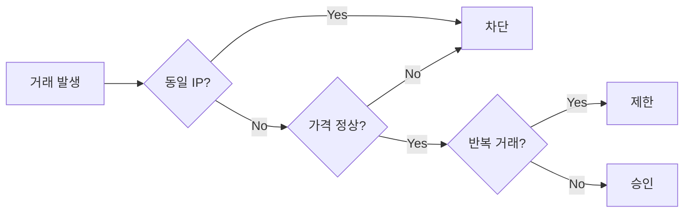

# 06. 마켓 시스템

## 두 가지 마켓

| 마켓           | 판매자 | 가격 결정               |
| -------------- | ------ | ----------------------- |
| 🌐 글로벌 마켓 | 시스템 | 변동가 (수요·공급 기반) |
| 🏪 유저 상점   | 유저   | 유저가 직접 올림        |

## 마켓 구조



## 글로벌 마켓 — 가격 변동

| 항목         | 값                                  |
| ------------ | ----------------------------------- |
| 변동 주기    | **30분**                            |
| 기본 변동 폭 | **±20%** (랜덤 노이즈)              |
| 변동 원인    | **하이브리드** (랜덤 + 거래량 기반) |
| 가격 상하한  | 기준가의 **70% ~ 200%**             |

### 가격 산출 공식

```
newPrice = clamp(
  basePrice × (1 + noise) × (1 + demandFactor),
  basePrice × 0.70,
  basePrice × 2.00
)

noise         = Random(-0.20, +0.20)
demandFactor  = (recentSales - avgSales) / avgSales × k   // k: 보정 계수 (예: 0.1)
```

- **30분마다** 모든 원자재 가격 재계산
- **거래량 보정**: 최근 30분 판매량이 평균보다 많으면 상승, 적으면 하락
- **극단값 방지**: 하한 70%, 상한 200%로 clamp
- **유저 직구매 가격** = `newPrice × 2` (04-economy.md 참고)

## 유저 상점 — 규칙

| 항목             | 규칙                                      |
| ---------------- | ----------------------------------------- |
| 기본 수수료      | 판매가의 **3%** (서버 금고로 귀속)        |
| 동시 등록 한도   | `5 + floor(level/5)` (최대 **20개**)      |
| 등록 기간        | **최대 30일** (유저 선택), 이후 자동 회수 |
| 기간별 추가 세율 | 기간이 길수록 세율 증가 (아래 표)         |
| 가격 제한        | 글로벌 가격의 **±50% 범위**만 허용        |

### 기간별 세율 테이블

등록 기간을 길게 설정할수록 시장 선점 효과가 커지므로, 세율을 누진 적용합니다.

| 등록 기간 | 총 세율 (기본 3% + 기간 할증) |
| --------- | ----------------------------- |
| 1~3일     | 3%                            |
| 4~7일     | 5%                            |
| 8~14일    | 8%                            |
| 15~21일   | 12%                           |
| 22~30일   | 18%                           |

공식:

```
tax = basePrice × salePrice × rateByDuration(days)
netRevenue = salePrice - tax
```

> **인플레 억제 의도**: 장기 등록은 공급 잠금 효과가 있어 시장 가격을 왜곡. 누진 세금으로 장기 매물 회전율을 유도.

## 사기 방지 규칙

자기 자신과의 거래로 경험치·돈을 파밍하지 못하게:

1. 같은 IP / 같은 디스코드 계정의 부계정 간 거래 제한
2. 짧은 시간 내 반복 거래 감지 (스팸 방지)
3. 비정상적으로 낮거나 높은 가격 거래 차단
4. 신규 계정은 일정 기간 마켓 제한



## 관련 스키마

참조: [`packages/database/prisma/schema.prisma`](https://github.com/filename24/Idle-Factory/blob/stable/packages/database/prisma/schema.prisma)

- `GlobalMarketPrice` — 자재별 변동가 (`basePrice`, `currentPrice`, `recentSales`, `updatedAt`) · 30분 주기 갱신
- `MarketListing` — 유저 상점 등록 (`price`, `qty`, `durationDays`, `taxRate`, `status`, `expiresAt`)
- `enum ListingStatus` — ACTIVE / SOLD / EXPIRED / CANCELED
- `TradeLog` — 거래 이력 (사기 방지·XP 중복 방지), `enum TradeKind` = MARKET_SELL / USER_TRADE / DIRECT_BUY 등
