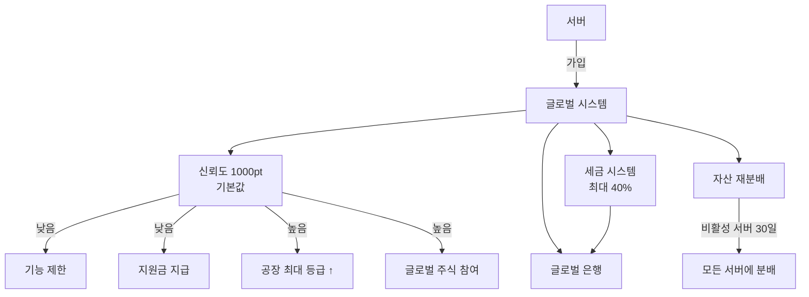
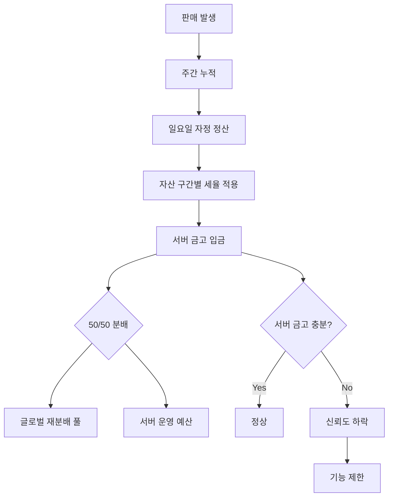
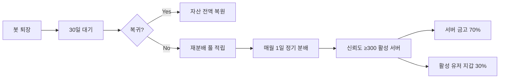

# 07. 글로벌 시스템

## 개요

봇에 참여한 모든 서버가 엮이는 **국제기구** 개념. 서버 단위의 신뢰도·세금·자산 분배 로직이 있다.

## 구성 요소



## 유저 귀속 모델 (2026-07-03 확정)

봇은 여러 서버에 동시에 참여하므로 **무엇이 유저에게 귀속되고 무엇이 서버에 귀속되는가**를 명확히 한다. 아래가 확정 모델이다 (D-1).

| 대상                                            | 귀속 기준                     | 설명                                                                                          |
| ----------------------------------------------- | ----------------------------- | --------------------------------------------------------------------------------------------- |
| **자산** (현금·창고·공장·주식)                  | **글로벌 단일 계정**          | 유저 자산은 서버와 무관하게 하나다. 어느 서버에서 명령을 실행하든 같은 지갑·창고·공장을 본다. |
| **과세·서버 금고 적립**                         | **판매가 발생한 서버**        | 주간 판매 수익을 '그 판매가 일어난 서버'별로 누적해, 해당 서버 금고로 세금을 이체한다.        |
| **버프·해금** (공장 최대 등급 +1/+2, XP 보너스) | **커맨드 실행 서버의 신뢰도** | 명령을 실행한 서버의 신뢰도 구간(§신뢰도 시스템)에 따라 그 순간의 버프가 결정된다.            |

### 과세 모델 상세

- **세율 = 글로벌 자산 누진 구간(§세율 — 자산 기반 누진세) + 해당 서버 가산세(`Guild.taxSurcharge`)**. 누진 구간은 유저의 **글로벌 총자산**(§총자산 평가) 기준, 가산세는 **판매가 발생한 서버** 기준으로 각각 결정된다.
- **이중과세 없음** — 한 거래는 정확히 **한 번만** 과세된다. 거래의 활동 서버는 `TradeLog.guildId`(거래 시점 캡처)로 확정되며, 주간 정산에서 그 서버로만 귀속된다.
- 마켓 등록 시점의 활동 서버는 `MarketListing.guildId`에 캡처되어, 인터랙션이 없는 만료 회수(`expireStale`)에서도 활동 서버를 승계한다.

> **스키마 근거**: `TradeLog.guildId`·`MarketListing.guildId` 컬럼이 이미 스키마에 존재한다(PR #35). 서버 탈퇴 시 두 FK 모두 `onDelete: SetNull`로 유령 참조를 방어한다.

## 신뢰도 시스템

- 서버 단위로 관리
- 기본값: **1,000 pt**
- 범위: 0 ~ 2,000 (상한 clamp)

### 신뢰도 효과 (구간별)

| 구간          | 효과                                                           |
| ------------- | -------------------------------------------------------------- |
| 0 ~ 300       | 대부분 기능 제한, 글로벌 은행에서 최대 100만원 **긴급 지원금** |
| 300 ~ 700     | 일부 기능 제한 (유저 상점 등록 불가 등)                        |
| 700 ~ 1,000   | 정상 운영                                                      |
| 1,000 ~ 1,500 | 공장 최대 등급 +1, 경험치 +10%                                 |
| 1,500+        | **글로벌 주식 참여 가능**, 공장 최대 등급 +2, 경험치 +20%      |

### 신뢰도 변동 — 활성도 기반

**주 1회 정산 시 (일요일 자정)** 해당 서버의 DAU 활성도로 신뢰도를 조정합니다.

```
delta = floor(weeklyDAU × 0.5) - baselineDecay

baselineDecay = 10   // 매주 자연 감쇠 (활성도 없으면 하락)
```

예시:

- DAU 20명 → +10 - 10 = ±0 (유지)
- DAU 40명 → +20 - 10 = **+10**
- DAU 5명 → +2 - 10 = **-8**
- DAU 0명 → 0 - 10 = **-10**

> 세금 미납은 별도로 처리 (금고 부족 시 매일 -10, 기존 로직 유지).

## 세금 시스템

### 과세 대상

- **판매 수익에만 과세** (마켓에서 판매 시)
- 생산 tick 자체에는 과세하지 않음 (미실현 자산 제외)
- 유저 상점 수수료와는 **별도** (06-market.md 참고)

### 세율 — 자산 기반 누진세

유저의 총 자산(현금 + 창고 자재 평가액 + 공장 평가액) 구간에 따라 누진 적용:

| 자산 구간       | 세율 |
| --------------- | ---- |
| 0 ~ 100만       | 5%   |
| 100만 ~ 1,000만 | 10%  |
| 1,000만 ~ 1억   | 15%  |
| 1억 이상        | 20%  |

> 서버 관리자는 **세율 가산치**(0 ~ +20%p)만 조정 가능. 최대 세율 40% 유지.

### 정산 주기

- **주 1회 정산** (매주 일요일 자정 기준)
- 주간 판매 수익 누적 → 구간별 세율 적용 → 서버 금고로 이체
- 유저는 정산 직전 자산 이동 불가 (회피 방지)

### 세금 용도 (서버 금고 분배)

| 비율    | 용도                                               |
| ------- | -------------------------------------------------- |
| **50%** | 글로벌 재분배 풀 (비활성 서버 분배용)              |
| **50%** | 서버 운영 보상 (관리자 재량 예산: 이벤트, 상금 등) |

### 세금 흐름



**신뢰도 유지 공식(제안)**:

- 세율 × 서버 총자산 × 계수 < 실제 서버 금고
- 불만족 시 매일 신뢰도 -10

## 비활성 서버 자산 분배

### 수집 & 분배 정책

| 항목           | 정책                                                 |
| -------------- | ---------------------------------------------------- |
| 수집 트리거    | 봇이 서버에서 **퇴장 후 30일 경과**                  |
| 30일 이내 복귀 | **자산 전액 복원** (유저 지갑/금고 포함)             |
| 30일 초과      | 서버 금고 + 유저 지갑 자산 전부 **재분배 풀**로 이동 |
| 분배 주기      | **월 1회 정기 분배** (매월 1일 자정)                 |
| 분배 대상      | **모든 활성 서버** (신뢰도 300+ 서버만 수혜)         |
| 분배 비율      | **서버 금고 70% / 해당 서버 활성 유저 지갑 30%**     |

### 분배 공식

```
monthlyPool = sum(모든 비활성 서버의 퇴장 자산)

eligibleServers = 신뢰도 ≥ 300 인 활성 서버 목록
weight(server) = server.weeklyDAU + log(server.totalAssets + 1)

share(server)  = monthlyPool / sum(weight(all eligible))  × weight(server)

  → server.vault       += share(server) × 0.70
  → server.activeUsers 에게 균등 분배  += share(server) × 0.30
```

> **70:30 배분 의도**: 서버 운영 유지(금고)와 개별 유저 체감 혜택(지갑) 모두 제공.



## 관련 스키마

참조: [`packages/database/prisma/schema.prisma`](https://github.com/filename24/Idle-Factory/blob/stable/packages/database/prisma/schema.prisma)

- `Guild.credit` — 서버 신뢰도 (-1000 ~ 10000)
- `Guild.vault` — 서버 금고 (BigInt)
- `Guild.taxSurcharge` — 서버별 추가 세율 (기본 0.1)
- `Guild.weeklyDAU` — 주간 활성 유저 수 (신뢰도 증감 기준)
- `WeeklySettlement` — 주 1회 세금 정산 기록 (`weekStart` unique per guild)
- `InactiveServerPool` — 30일 비활성 서버 자산 재분배 풀
