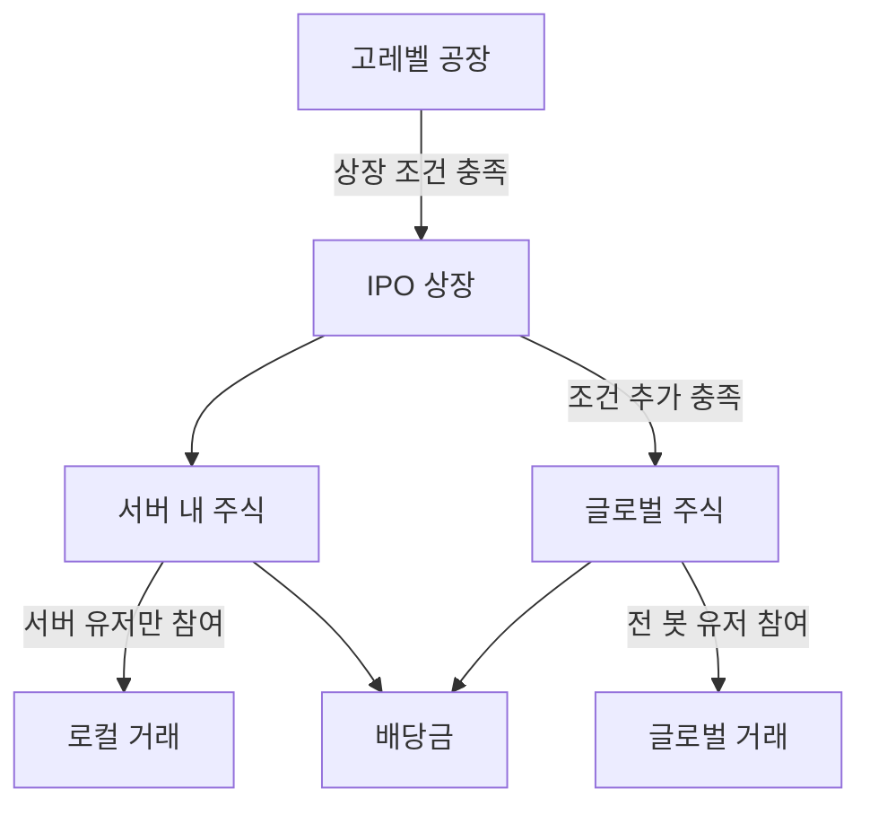

# 08. 주식 시스템

## 개요

성장한 공장이 회사가 되어 주식시장에 상장되는 시스템. **글로벌 주식**과 **서버 내 주식** 두 종류.

## 주식 시장 구조



## 상장 조건

**모든 조건 AND** (관리자 승인 없음 — 자동 검증):

| 조건             | 기준                         |
| ---------------- | ---------------------------- |
| 레벨             | **Lv.25 이상**               |
| 공장 수          | **5개 이상**                 |
| 총 자산          | **1억 원 이상**              |
| 최근 거래 활성도 | **최근 30일 거래 10회 이상** |

### 글로벌 주식 추가 조건

- 유저 **Lv.40+** (글로벌 주식 해금, 09-level-xp.md)
- 소속 서버 **신뢰도 1,500+**

## 주가 결정

### IPO 가격 — 기본 공식

```
defaultIPO = (totalAssets + recent30dProfit × 10) / sharesOutstanding
sharesOutstanding = 100   // 기본 발행 주식 수
```

### IPO 최종가 — 유저 재량 (30~70% 범위)

상장 유저가 IPO 가격을 **기본값의 30~70% 범위**에서 직접 설정합니다.

```
finalIPO = clamp(userSetPrice, defaultIPO × 0.30, defaultIPO × 0.70)
```

> 고/저평가 극단 방지 + 유저 선택권 보장.

### 주가 변동 — 1시간 주기

- **1시간마다** 모든 상장 종목 가격 재계산
- 요인: 최근 1시간 매수/매도 체결, 24시간 수익 변화율, 자재 가격 간접 영향

```
newPrice = prevPrice × (1 + demandPressure + profitDelta × 0.3)

demandPressure = (buyVolume - sellVolume) / totalVolume × 0.1
profitDelta    = (last24hProfit - avg7dProfit) / avg7dProfit
```

- **서킷브레이커**: 일일 ±30% clamp
- **0-나눗셈 가드 (U-5, 2026-07-03 확정)**: `totalVolume = 0` 이면 `demandPressure = 0`, `avg7dProfit = 0` 이면 `profitDelta = 0` 으로 처리한다. ※ 주가 재계산 알고리즘은 아직 미구현이며, 본 가드는 구현 시 지켜야 할 확정 스펙이다.

## 배당 시스템

| 항목      | 규칙                                                 |
| --------- | ---------------------------------------------------- |
| 주기      | **주 1회** (매주 일요일 자정, 세금 정산과 동일 시점) |
| 배당 재원 | 해당 회사의 **주간 수익의 10%**                      |
| 분배      | 보유 지분 비율로 자동 지급                           |

```
eachShareDividend = (weeklyProfit × 0.10) / sharesOutstanding
userDividend      = eachShareDividend × userSharesHeld
```

## 매수/매도 수수료

**없음** — 주식 거래는 무수수료. 인플레 억제는 자산 누진세(07-global-system.md)에서 담당.

## 사기 방지

- 자기 자신 상장 주식 자기거래 금지
- 동일 IP/부계정 간 거래 차단
- 동일 종목 1시간 내 반복 매수/매도 rate limit
- **공매도 미지원** (MVP 스코프 외)

## 미결정 사항 (MVP 후 튜닝)

- 상장 폐지 조건 (자산 하한 미달 등)
- 유상증자·주식 분할 기능
- 주주총회 기능

## 관련 스키마

참조: [`packages/database/prisma/schema.prisma`](https://github.com/filename24/Idle-Factory/blob/stable/packages/database/prisma/schema.prisma)

- `Stock` — 상장 종목 (`issuerUserId`, `market`, `totalShares`, `currentPrice`, `dividendRate`)
- `StockHolding` — 보유 지분 (`userId + stockId` unique, `shares`, `avgBuyPrice`)
- `StockPriceTick` — 가격 히스토리 (차트·공시용)
- `enum StockMarket` — SERVER (코드 현행 게이팅: **Lv.10+**) / GLOBAL (**Lv.40+ · 신뢰도 1500+**). ※ 서버 주식에 **신뢰도 하한(500+)** 을 둘지는 보류 (모순 9, Phase 4 전 결정 — 07 참조)
