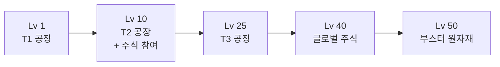

# 09. 레벨 · 경험치

## 경험치 획득 (행동별)

가중치 분배로 거래·판매 중심 플레이를 유도합니다.

| 행동                    | XP                        |
| ----------------------- | ------------------------- |
| 생산 tick (자동)        | **+5**                    |
| 마켓 판매 (유저/글로벌) | **+20**                   |
| 유저 직거래             | **+15**                   |
| 주식 수익 실현          | **+10**                   |
| 공장 건설               | 비용 × 0.001 (상한 1,000) |
| 공장 업그레이드         | 비용 × 0.001 (상한 1,000) |

## 레벨업 공식

```
Level N → N+1 요구 XP = 100 × N^2.2
```

누적 XP 예시:

| 레벨    | 해당 레벨 요구 XP | 누적 XP   |
| ------- | ----------------- | --------- |
| 1→2     | 100               | 100       |
| 2→3     | ~459              | ~559      |
| 5→6     | ~3,406            | ~8,000    |
| 10→11   | ~15,849           | ~57,000   |
| 25→26   | ~130,000          | ~1.2M     |
| 50 누적 | —                 | **~2.5M** |

> `N^2.2`는 `N^2`보다 후반이 가파름 → 고레벨 인플레 억제.

## 일일 XP 한도

**한도 없음** — 활발한 활동을 장려. 파밍은 XP 공식(상한)과 사기 방지 로직으로 제어.

## 레벨별 해금



| 레벨   | 해금 기능                                |
| ------ | ---------------------------------------- |
| **1**  | T1 공장 (농장·광산·벌목·유전)            |
| **10** | T2 공장 + **서버 주식 참여** (매수/매도) |
| **25** | T3 공장 (완제품) + 주식 상장 자격        |
| **40** | 글로벌 주식 참여 (신뢰도 1500+ 서버)     |
| **50** | 부스터 원자재 사용                       |

## 사기 방지

- 동일 상대와의 반복 거래는 XP 감소 (N회 이후 0)
- 짧은 시간 대량 거래 시 XP 0
- 동일 IP/부계정 간 거래는 XP 미지급
- 비정상 가격 거래(글로벌 ±50% 벗어남) 차단

## 레벨업 보상 (MVP 후 튜닝)

- 3, 5, 7, 10등급 공장처럼 특정 레벨마다 부스터 선택
- 창고 용량 무료 +1
- 최대 등급 상한 해제

## 관련 스키마

참조: [`packages/database/prisma/schema.prisma`](../../packages/database/prisma/schema.prisma)

- `User.xp` (BigInt) · `User.level` — 레벨/경험치
- `TradeLog` — 거래 이력 기반 XP 중복 방지 (동일 상대 반복 거래 감지)
- `enum TradeKind` — XP 지급 대상 행동 분류 (USER_TRADE / MARKET_SELL / STOCK_TRADE 등)
