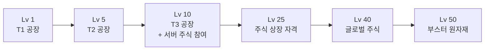

# 09. 레벨 · 경험치

## 경험치 획득 (행동별)

가중치 분배로 거래·판매 중심 플레이를 유도합니다.

| 행동                    | XP                        |
| ----------------------- | ------------------------- |
| 생산 tick (자동)        | **+5**                    |
| 마켓 판매 (유저/글로벌) | **+20**                   |
| 유저 직거래             | **+15**                   |
| 주식 수익 실현          | **+10**                   |
| 공장 건설               | 비용 × 0.001 (상한 1,000) |
| 공장 업그레이드         | 비용 × 0.001 (상한 1,000) |

## 레벨업 공식

```
Level N → N+1 요구 XP = 100 × N^2.2
```

누적 XP 예시:

| 레벨    | 해당 레벨 요구 XP | 누적 XP   |
| ------- | ----------------- | --------- |
| 1→2     | 100               | 100       |
| 2→3     | ~459              | ~559      |
| 5→6     | ~3,406            | ~8,000    |
| 10→11   | ~15,849           | ~57,000   |
| 25→26   | ~130,000          | ~1.2M     |
| 50 누적 | —                 | **~2.5M** |

> `N^2.2`는 `N^2`보다 후반이 가파름 → 고레벨 인플레 억제.

## 일일 XP 한도

**한도 없음** — 활발한 활동을 장려. 파밍은 XP 공식(상한)과 사기 방지 로직으로 제어.

## 레벨별 해금



| 레벨   | 해금 기능                                                       |
| ------ | --------------------------------------------------------------- |
| **1**  | T1 공장 (농장·광산·벌목·유전)                                   |
| **5**  | T2 공장 (제철소·정유소·제분소·가구공장)                         |
| **10** | T3 공장 (자동차·전자제품·식품) + **서버 주식 참여** (매수/매도) |
| **25** | 주식 상장 자격                                                  |
| **40** | 글로벌 주식 참여 (신뢰도 1500+ 서버)                            |
| **50** | 부스터 원자재 사용                                              |

> **로스터 완성 (2026-07-03 확정):** 균일안 채택 — T1(유전 포함) Lv.1 / T2 전체 Lv.5 / T3 전체 Lv.10. 잠겨 있던 5종(유전·정유소·가구공장·전자제품·식품)을 위 표 기준으로 해금해 11종 로스터를 완성한다. 스태거드안은 밸런스 시뮬레이터 근거 확보 후 튜닝 옵션으로 보류. 카탈로그 출처: [`packages/game-core/src/factories/catalog.ts`](https://github.com/filename24/Idle-Factory/blob/stable/packages/game-core/src/factories/catalog.ts).

> **미구현 (후속 스코프)**: Lv.40 글로벌 주식 참여 규칙은 확정 스펙(D13)이나 현재 코드에는
> 반영되어 있지 않다. `packages/game-core/src/stock/listing.ts` 는 "글로벌 주식 추가 조건
> (Lv.40+·신뢰도 1500+)은 스코프 아웃 (D13 — GLOBAL 마켓 Phase 5+)"이라 명시하고,
> `apps/bot/src/services/stock.ts` 도 "신뢰도 게이트(서버 500+/글로벌 1500+)는 #17
> 미구현으로 보류"라 기록한다. `enum StockMarket` 의 `GLOBAL` 값(`schema.prisma`)만
> 스키마에 존재하며, 레벨·신뢰도 게이트 로직은 구현돼 있지 않다.

## 사기 방지

- 동일 상대와의 반복 거래는 XP 감소 (N회 이후 0)
- 짧은 시간 대량 거래 시 XP 0
- 동일 IP/부계정 간 거래는 XP 미지급
- 비정상 가격 거래(글로벌 ±50% 벗어남) 차단

> **미구현 (후속 스코프)**: 위 "동일 IP/부계정" 규칙은 확정 스펙이나 현재 코드에는 반영되어
> 있지 않다. IP 취득이 기술적으로 불가능해 신규 계정·신규 서버 멤버 여부를 대체 신뢰
> 시그널로 계산하지만(`assessActorTrust()`, `apps/bot/src/services/tradeLog.ts`), v0 는
> 이 시그널을 차단 없이 로깅만 할 뿐(비차단) `grantMarketSellReward()`(같은 파일)는 이를
> 참조하지 않아 XP 는 감쇠 없이 그대로 지급된다. 상세는 `docs/design/06-market.md` §사기
> 방지 규칙 참고.

## 레벨업 보상 (MVP 후 튜닝)

- 3, 5, 7, 10등급 공장처럼 특정 레벨마다 부스터 선택
- 창고 용량 무료 +1
- 최대 등급 상한 해제

## 관련 스키마

참조: [`packages/database/prisma/schema.prisma`](https://github.com/filename24/Idle-Factory/blob/stable/packages/database/prisma/schema.prisma)

- `User.xp` (BigInt) · `User.level` — 레벨/경험치
- `TradeLog` — 거래 이력 기반 XP 중복 방지 (동일 상대 반복 거래 감지)
- `enum TradeKind` — XP 지급 대상 행동 분류 (USER_TRADE / MARKET_SELL / STOCK_BUY / STOCK_SELL 등)
