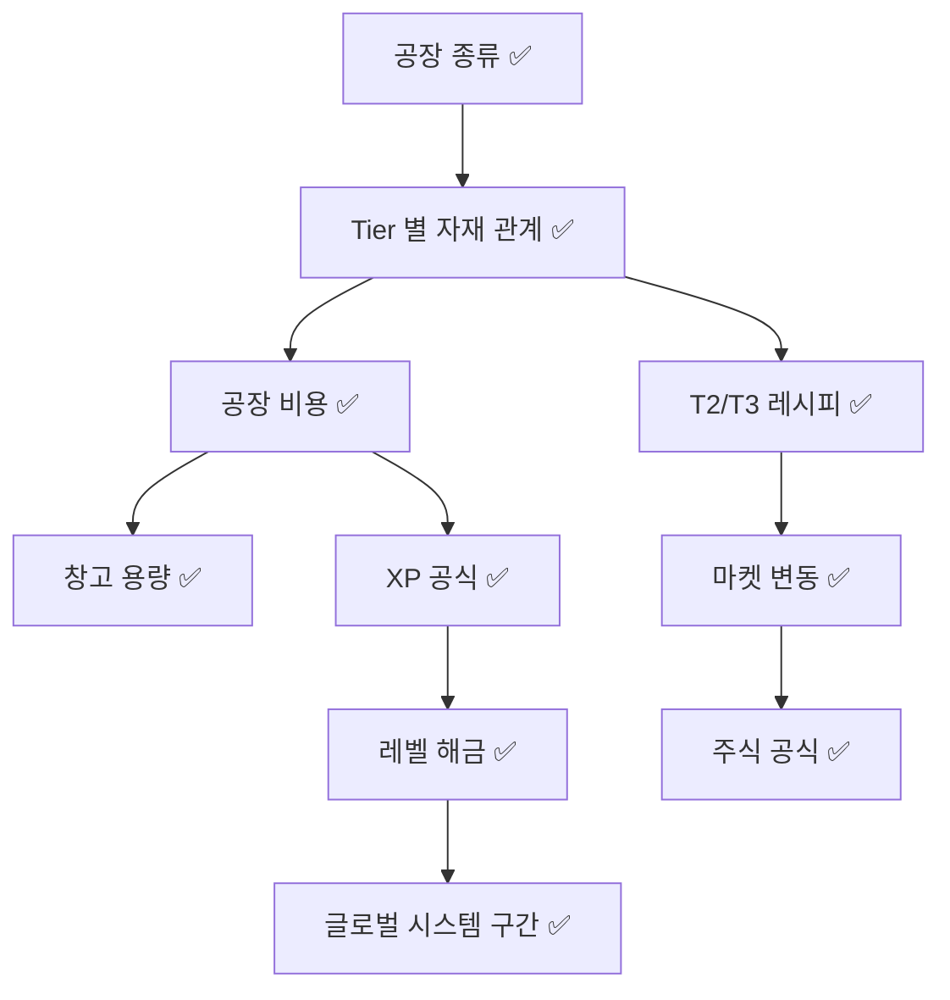

# 10. 미결정 이슈 (Open Questions)

개발 시작 전에 반드시 결정해야 할 항목들.

## 🔴 Critical (MVP 개발 전 필수)

### 공장 시스템

- [x] ~~**건설 · 업그레이드 비용** 확정 (3배 성장)~~
- [x] ~~**생산량 기준값** 확정 (B+C 하이브리드, 등급당 ×1.5배)~~
- [x] ~~**생산 주기**: 10분마다 1 tick, 수동 수확~~
- [x] ~~**T2/T3 레시피** 확정 + 부스터 선택 시스템 + 자재 부족 대응 모드~~

### 창고

- [x] ~~**창고 시스템 확정**: 공용 1개 / 토지 1슬롯 차지 / 가득 차면 생산 중단 / 등급 1~10~~

### 경제

- [x] ~~**자재 직구매** 확정: ×2배 할증 / T1+T2만 / 레벨별 타이트 한도~~
- [x] ~~**세금 시스템** 확정: 판매수익 과세 / 자산 누진 5~20% / 주 1회 정산 / 50:50 분배~~

### 마켓

- [x] ~~**글로벌 가격 변동** 확정: 30분 주기 / ±20% / 하이브리드 / 70~200% clamp~~
- [x] ~~**유저 상점 수수료** 확정: 기본 3% + 기간별 누진 (최대 18% @30일)~~
- [x] ~~**유저 상점 등록 한도** 확정: `5 + floor(level/5)`, 최대 20개~~
- [x] ~~**유저 상점 가격 제한** 확정: 글로벌 가격 ±50%~~

### 레벨/XP

- [x] ~~**행동별 XP** 확정: 생산+5 / 판매+20 / 거래+15 / 주식+10, 건설·업글 비용×0.001 (상한 1,000)~~
- [x] ~~**레벨업 요구 XP** 확정: `100 × N^2.2` (Lv.50 누적 ~2.5M)~~
- [x] ~~**레벨별 해금** 확정: Lv.1 T1 / Lv.5 T2 / Lv.10 T3+주식 / Lv.25 상장 / Lv.40 글로벌주식 / Lv.50 부스터~~ (D-2, 2026-07-03)
- [x] ~~**일일 XP 한도** 확정: 한도 없음 (공식·사기방지로 제어)~~

## 🟡 High (MVP 후 결정 가능)

### 글로벌 시스템

- [x] ~~**신뢰도 구간 효과** 확정: 0~300 제한+지원 / 700~1000 정상 / 1500+ 글로벌주식~~
- [x] ~~**신뢰도 변동** 확정: 주 1회 `DAU × 0.5 - 10` (세금 미납 별도)~~
- [x] ~~**비활성 서버 분배** 확정: 월 1회 정기 / 금고 70% + 유저 30% / 신뢰도 300+ 서버만~~

### 주식

- [x] ~~**상장 기준** 확정: Lv.25 + 공장 5개 + 자산 1억 + 최근30일 거래 10회 (자동검증)~~
- [x] ~~**주가 공식** 확정: IPO `(자산 + 30일수익×10)/100` 기본, 유저가 30~70% 범위 선택 / 시세 1시간 재계산~~
- [x] ~~**배당** 확정: 주 1회, 주간 수익의 10%~~
- [x] ~~**매수/매도 수수료** 확정: 없음~~

### 부스터 (원자재)

- [x] ~~**지속시간** 확정: 영구 (공장당 1회 소비)~~
- [x] ~~**중복 규칙** 확정: 공장당 1개, 교체 불가~~
- [x] ~~**효과** 확정: 등급 배율 ×1.2 (`1.5^N × 1.2`)~~
- [x] ~~**획득 경로** 확정: T3 공장 저확률 생산 + 마켓/유저상점/직거래 모두 유통~~

## 🟢 Medium (릴리스 후 튜닝)

- [ ] 사기 방지 규칙 세부 수치
- [ ] UI/명령어 구조
- [x] ~~서버 관리자 전용 명령어~~ 구현 완료
  > **코드 기준**: `apps/bot/src/commands/game/server.ts` 의 `/server announce`, `apps/bot/src/interaction-handlers/buttons/guildSettings.ts`·`selects/guildSettingsTax.ts` 가 Discord `ManageGuild` 권한으로 게이팅된 서버 관리자 전용 기능을 구현한다.
- [x] ~~통계/대시보드 페이지~~ 구현 완료
  > **코드 기준**: `apps/web/src/app/dashboard/`(`me/`, `[guildId]/`)와 `apps/web/src/app/ranking/` 이 `StatTile`·`BarChart`·`GuildRankingTable`·`UserRankingTable` 컴포넌트로 개인·서버 대시보드와 랭킹 페이지를 서비스한다.
- [ ] 알림/이벤트 시스템

## 🔵 Low (향후 로드맵)

- [x] ~~i18n 지원~~ 구현 완료 (#60)
  > **코드 기준**: 봇은 `apps/bot/src/commands/settings/language.ts`(`LanguageCommand`)와 `apps/bot/src/utils/language.ts`(`SUPPORTED_LANGUAGES`, `resolveLanguage()`)로, 웹은 `apps/web/src/i18n/config.ts`(`LOCALES`, `resolveLocale()`)와 `LocaleSwitcher` 컴포넌트로 ko/en 전환을 지원한다.
- [ ] 시즌/이벤트 시스템
- [ ] 업적 시스템
- [ ] 길드/연합 시스템
- [ ] 서버 간 전쟁/무역 협정

## 결정 의존성

> **코드 기준**: `packages/game-core/src/factories/cost.ts`(`buildCost`·`upgradeMoneyCost`), `factories/catalog.ts`(`FACTORY_CATALOG`), `warehouse/capacity.ts`(`WAREHOUSE_CAPACITY`), `xp/level.ts`(`xpForEvent`·`xpRequiredForLevel`), `land/expansion.ts`(`landExpansionLevelRequirement`)와 `apps/bot/src/services/marketPrice.ts`·`services/stock.ts`·`services/guild.ts`(`CreditEffects`)가 위 항목을 모두 구현한다.
