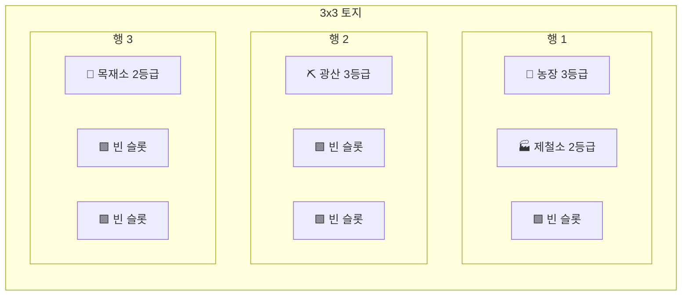

# 11. 토지 시스템

## 개요

유저는 **토지(Land)** 위에 공장을 배치한다. Discord에서 **이모지 그리드**로 시각화.

## 기본 구조

- 기본 토지 크기: **3 × 3 (9 슬롯)**
- 슬롯당 T1·T2 공장 1개 배치
- **T3 공장은 2×2 (4 슬롯) 차지** — 크기가 크므로 토지가 좁으면 건설 불가
- 슬롯에는 **일반 / 특수 슬롯** 구분이 있음 (아래 참고)
- 확장 가능 (돈/자재 소모)

## 공장 크기

| Tier                          | 차지 슬롯 |
| ----------------------------- | --------- |
| T1 (농장, 광산, 목재소, 유전) | 1 × 1     |
| T2 (제철소, 정유소 등)        | 1 × 1     |
| T3 (자동차, 전자, 식품)       | **2 × 2** |

→ 3×3 토지에는 T3 공장 1개만 배치 가능. 본격적인 T3 운영은 **4×4 이상 확장 필요**.

## 특수 슬롯 (자연자원 매장지)

토지 생성 시 랜덤으로 특수 슬롯이 배치됨. 해당 슬롯에 적합한 공장을 지으면 **추가 보너스**.

| 특수 슬롯 | 이모지 | 효과                  |
| --------- | ------ | --------------------- |
| 광맥      | 🪨     | 광산 생산량 +20%      |
| 비옥한 땅 | 🌱     | 농장 생산량 +20%      |
| 숲        | 🌳     | 목재소 생산량 +20%    |
| 유전지    | 🛢️     | 유전 생산량 +30%      |
| 수로      | 💧     | 인접 농장·제분소 +10% |

→ 일반 공장도 특수 슬롯 위에 지을 수는 있지만 보너스 없음.

## 인접 시너지 (A-2)

공장이 체인 관계로 인접(상하좌우)하면 생산 보너스.

| 조합              | 효과               |
| ----------------- | ------------------ |
| 광산 ↔ 제철소     | 제철소 생산 +10%   |
| 유전 ↔ 정유소     | 정유소 생산 +10%   |
| 농장 ↔ 제분소     | 제분소 생산 +10%   |
| 목재소 ↔ 가구공장 | 가구공장 생산 +10% |
| 제철소 ↔ 자동차   | 자동차 생산 +5%    |
| 정유소 ↔ 자동차   | 자동차 생산 +5%    |
| 제분소 ↔ 식품     | 식품 생산 +5%      |
| 수로(특수) ↔ 농장 | 농장 생산 +10%     |

**중첩 규칙**: 여러 시너지가 겹치면 합산, **공장당 최대 +30%** clamp.

## Discord 시각화 예시

빈 토지:

```
🟩🟩🟩
🟩🟩🟩
🟩🟩🟩
```

공장 배치 후:

```
🌾🏭🟩
⛏️🟩🟩
🌲🟩🟩
```

### 슬롯 이모지

| 이모지 | 의미                     |
| ------ | ------------------------ |
| 🟩     | 빈 일반 슬롯             |
| 🟫     | 잠긴 슬롯 (확장 필요)    |
| 🪨     | 빈 특수 슬롯 (광맥)      |
| 🌱     | 빈 특수 슬롯 (비옥한 땅) |
| 🌳     | 빈 특수 슬롯 (숲)        |
| 💧     | 빈 특수 슬롯 (수로)      |

### 공장 이모지 + 등급 (D-2)

| 이모지 | 공장                |
| ------ | ------------------- |
| 🌾     | 농장                |
| ⛏️     | 광산                |
| 🌲     | 목재소              |
| 🛢️     | 유전                |
| 🏭     | 제철소              |
| ⚗️     | 정유소              |
| 🍞     | 제분소              |
| 🪑     | 가구공장            |
| 🚗     | 자동차 공장 (2×2)   |
| 📱     | 전자제품 공장 (2×2) |
| 🍱     | 식품 공장 (2×2)     |

공장 이모지 옆에 **상첨자**로 등급 표시: `🌾³` = 농장 3등급.

T3는 4 슬롯 모두에 같은 이모지를 표시하거나 중앙에 큰 이모지 + 주변 표시.

### 표시 예시

3×3 토지에 T3 자동차 공장(2×2) + 일반 공장들:

```
🚗 🚗 🌾³
🚗 🚗 ⛏²
🌲¹ 🏭² 💧
```

(🚗가 좌상단 2×2 점유, 💧는 비어있는 수로 특수 슬롯)

## 토지 확장 — 누진 비용

9슬롯(3×3) 이후 **슬롯 단위 구매**. 확장할수록 기하급수적으로 비쌈.

```
N번째 슬롯 비용 = 1,000,000 × 1.5^(N - 9)
```

| 슬롯 # | 크기        | 개별 슬롯 비용 | 해당 행/열까지 누적 (근사) |
| ------ | ----------- | -------------- | -------------------------- |
| 10번째 | 4×3 첫 슬롯 | 1,000,000      | 1,000,000                  |
| 16번째 | 4×4 완성    | 11,390,625     | ~30M                       |
| 25번째 | 5×5 완성    | 437,893,890    | ~1.3B                      |
| 36번째 | 6×6 완성    | 약 25조        | 사실상 대자본 유저만       |

- 확장은 **슬롯 하나씩** 추가 가능 (꼭 정사각형일 필요 없음)
- 최대 토지 크기 **10×10 (100슬롯)**, 추가로 **글로벌 신뢰도 1500+** 조건

## 공장 이동 · 철거

| 행동          | 비용 / 환불                                           |
| ------------- | ----------------------------------------------------- |
| **공장 이동** | 해당 공장 **신축 비용의 25%** 지불                    |
| **공장 철거** | 해당 공장 **신축 비용의 50% 환불** (자재는 환불 없음) |

- 이동: 같은 토지 내 빈 슬롯으로만. 등급·내용물 유지
- 철거: 등급 정보·업그레이드 부스터 선택 소멸, 원자재 부스터는 같이 소멸
- 이동·철거 시 **인접 시너지 재계산**

## 특수 슬롯 리롤

**불가** — 토지 생성 시 랜덤으로 배치된 특수 슬롯은 **고정**. 운빨 요소 유지 + 장기적 토지 설계 압박.

> 불리한 배치로 느끼면 확장(누진)으로 더 많은 기회를 구매하는 것이 정공법.

## Discord 명령어 (제안)

```
/land view              # 내 토지 보기
/land build <공장> <x> <y>  # 특정 슬롯에 공장 건설
/land move <출발> <도착>    # 공장 이동
/land destroy <x> <y>   # 공장 철거
/land expand            # 토지 확장
```

## 데이터 구조 (제안)

```ts
interface Land {
  userId: string // Discord snowflake
  size: { width: number; height: number } // 기본 {3, 3}
  slots: Slot[]
}

interface Slot {
  x: number
  y: number
  type: 'normal' | 'ore' | 'fertile' | 'forest' | 'oil' | 'water'
  factoryId: string | null // 비어있으면 null, 다중 슬롯 공장은 같은 id 공유
  locked: boolean // 확장 전이면 true
}

interface Factory {
  id: string
  userId: string
  type: FactoryType
  grade: number // 1~10
  size: { width: number; height: number } // T1/T2는 {1,1}, T3는 {2,2}
  anchor: { x: number; y: number } // 좌상단 슬롯 위치
}
```

## 시각화 예시 (mermaid)



## 특수 슬롯 생성 규칙

- **희귀 배치**: 3×3 기본 토지당 **1~2개** (평균 1.5개)
- 확장 시: **추가 슬롯에도 랜덤으로 특수 생성**
- 특수 슬롯 생성 확률: 슬롯당 약 **15%**
- 종류도 랜덤 (광맥 / 비옥한 땅 / 숲 / 유전지 / 수로 중 선택)
- 한 토지에 **같은 종류 특수 슬롯 최대 2개** (편중 방지)

### 생성 로직 (의사 코드)

```
for each slot in new_slots:
    if random() < 0.15:
        available_types = [type for type in SPECIAL_TYPES if count[type] < 2]
        slot.type = random.choice(available_types)
    else:
        slot.type = 'normal'
```

## 결정 사항 (Summary)

- [x] 인접 시너지 **있음** (A-2)
- [x] 특수 슬롯 **있음** (B-2)
- [x] 자유 배치, 단 **T3는 2×2** (C-1 + 공장 크기 차이)
- [x] 이모지 + 상첨자 등급 (D-2)
- [x] 특수 슬롯 **희귀 (3×3당 1~2개, 확률 15%/슬롯)**
- [x] 확장 슬롯도 **랜덤 특수 생성**

## 결정 완료 (추가)

- [x] **확장 비용** 확정: `1,000,000 × 1.5^(N-9)` 누진
- [x] **시너지 상한** 확정: 공장당 최대 +30%
- [x] **이동 비용** 확정: 신축 비용의 25%
- [x] **철거 환불** 확정: 신축 비용의 50%
- [x] **특수 슬롯 리롤** 확정: 불가 (고정)

## 관련 스키마

참조: [`packages/database/prisma/schema.prisma`](../../packages/database/prisma/schema.prisma)

- `Land` — 유저당 1개 토지 (`userId` unique, `width`, `height`)
- `Slot` — 토지 내 셀 (`landId + x + y` unique, `type`)
- `enum SlotType` — NORMAL / FERTILE / ORE_RICH / SUNNY / WINDY / WAREHOUSE_RESERVED 등 특수 슬롯
- `Factory` 배치 필드 — `anchorX`, `anchorY`, `width`, `height` (T3는 2×2)
- `Warehouse` — 토지 위 1 슬롯 차지 (05-warehouse.md 참조)
